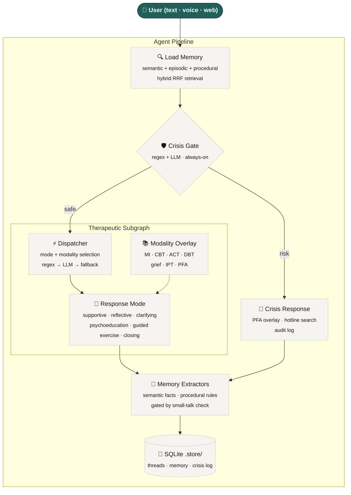

<div align="center">

<br/>


# OpenCouch

**An open-source mental health support agent with persistent memory, crisis safety, and natural voice.**

[](https://python.org)
[](https://nextjs.org)
[](https://langchain-ai.github.io/langgraph/)
[](https://platform.openai.com/docs/guides/realtime)
[](https://fastapi.tiangolo.com/)
[](LICENSE)

[Documentation](apps/docs/) · [Quick Start](#quick-start) · [Architecture](#architecture)

</div>

<br/>

> **Not a therapist. Not a diagnostic tool. Not an emergency service.**
> A support assistant for talking through difficult moments, reflecting on patterns, and practicing structured exercises — with real memory that carries across sessions.

---

## Overview

OpenCouch is built on [LangGraph](https://langchain-ai.github.io/langgraph/) for text and the [OpenAI Realtime API](https://platform.openai.com/docs/guides/realtime) for voice. It uses three [CoALA](https://arxiv.org/abs/2309.02427)-inspired memory layers (semantic facts, episodic arcs, procedural rules), an always-on crisis safety gate, six therapeutic response modes, and seven LLM-routed modalities.

### Capabilities

| Area | What it does |
|:---|:---|
| **Interaction** | Text CLI, WebSocket streaming, OpenAI Realtime voice (~300ms), Next.js web UI |
| **Memory** | Semantic facts · episodic session arcs · procedural style rules — inspectable, deletable, portable |
| **Safety** | Hybrid regex + LLM crisis gate on every turn · persistent audit log · web search for regional hotlines |
| **Modes** | Supportive · reflective · clarifying · psychoeducation · guided exercise · closing |
| **Modalities** | MI · CBT · ACT · DBT skills · grief · IPT · PFA — selected per turn by the LLM dispatcher |
| **Exercises** | 12 multi-turn structured exercises across 6 subtypes (grounding, thought work, activation, ACT, self-compassion, emotion regulation) |
| **Retrieval** | Embedding similarity + token-recall fused via Reciprocal Rank Fusion |
| **Privacy** | Persistent vs incognito sessions · per-fact deletion · full memory wipe |
| **Quality** | 545+ tests · 10 eval datasets · 9 assertion-based eval harnesses |

---

## Quick Start

### CLI

```bash
cd apps/backend && uv sync

# text
uv run python -m opencouch_cli --mode auto --memory-mode persistent --user-id alice --thread-id s1

# voice (requires OPENAI_API_KEY)
uv run python -m opencouch_cli --voice
```

### Web

```bash
# terminal 1 — API server
cd apps/backend && uv run uvicorn main:app --port 8000 --reload

# terminal 2 — frontend
cd apps/web && pnpm install && pnpm dev
```

Open [localhost:3000](http://localhost:3000) and choose **Persistent** (loads memory and history) or **Incognito** (fresh thread, nothing saved).

### Docs

```bash
cd apps/docs && pnpm install && npx docusaurus start --port 3001
```

---

## Architecture



---

## Contributing

```bash
# setup
cd apps/backend && uv sync --group dev

# tests (must pass before PR)
uv run pytest tests/

# evals
python eval/runners/therapeutic_routing_eval.py --mode deterministic
python eval/runners/exercise_selection_eval.py

# lint (runs automatically via pre-commit)
uv run ruff check . && uv run ruff format --check .
```

**Branch conventions:** `feature/*` for new capabilities, `fix/*` for bugs, `chore/*` for docs/infra. PRs target `develop`, releases merge `develop` → `main`.

**What to include in a PR:** clear title, summary of what changed and why, test plan checklist. If you're adding a guided exercise, include eval cases. If you're touching the crisis gate, include safety eval results.

---

## Roadmap

| Status | Area | What |
|:---:|:---|:---|
| 🟢 | Web frontend | Next.js UI with chat, voice, memory, state inspector |
| 🟢 | Guided exercises | 12 exercises across 6 subtypes with multi-turn state tracking |
| 🟢 | Modality routing | All 7 modalities LLM-routed per turn |
| 🟡 | Messaging channels | Telegram, WhatsApp, Discord adapters via `Channel` enum |
| 🟡 | Graph memory | Graphiti + Neo4j for entity-relationship reasoning |
| 🟡 | Background consolidation | Automatic fact merging, dormant marking, undo support |
| 🟡 | Acoustic crisis detection | Paralinguistic signals (voice cracking, prosodic flatness) |
| 🔵 | Clinical review | Clinician audit of knowledge files, prompts, and response quality |
| 🔵 | Deployment | Docker Compose, one-command setup, hosted demo |

🟢 shipped · 🟡 planned · 🔵 blocked on external dependency

---

<div align="center">
<sub>Built with care. Use with care.</sub>
</div>
