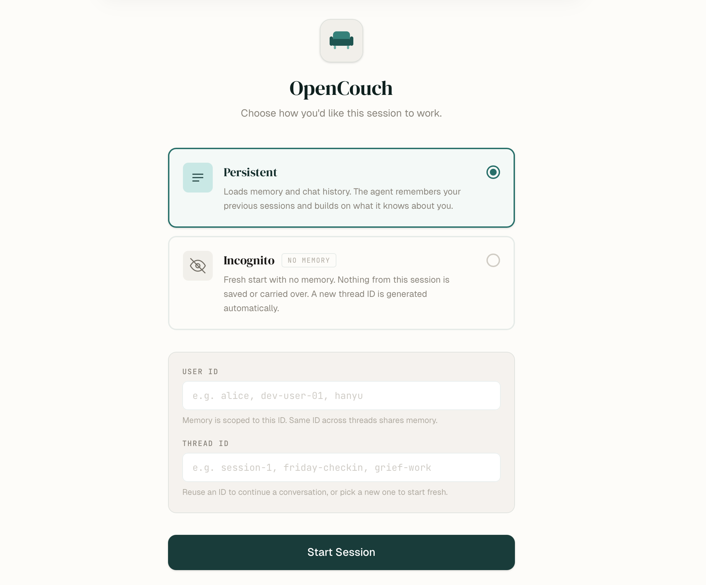
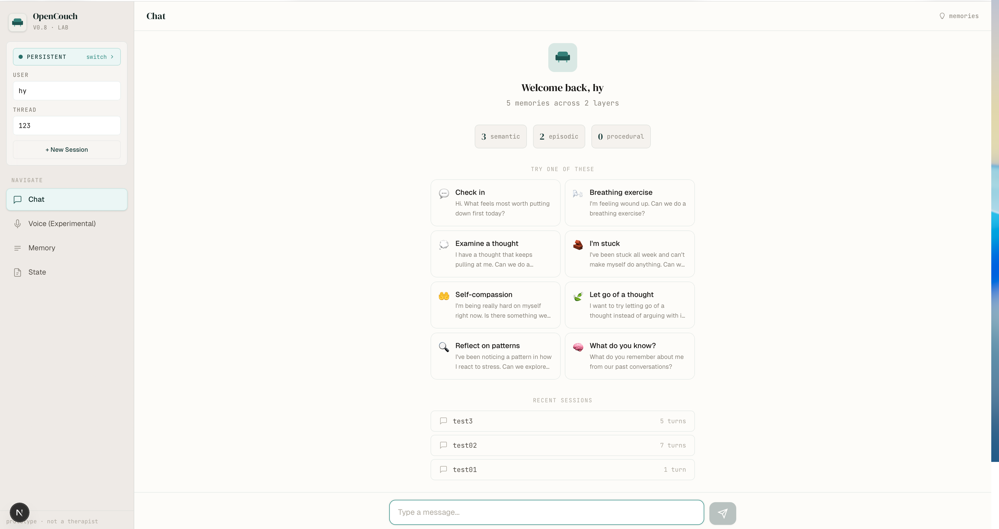
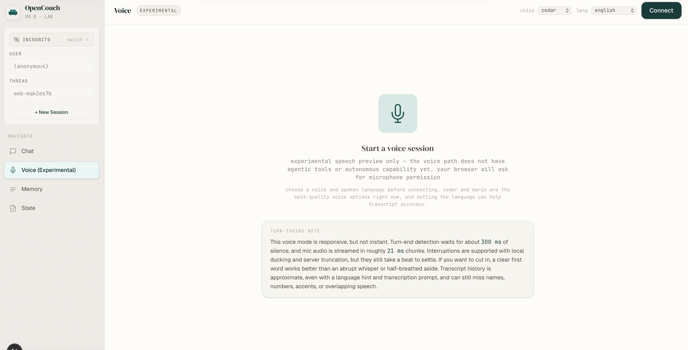
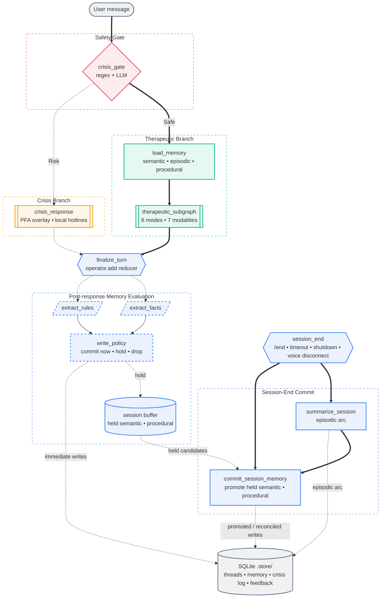

<div align="center">


# OpenCouch

**An open-source mental health support agent with persistent memory, crisis safety, and natural voice.**

[](https://python.org)
[](https://nextjs.org)
[](https://langchain-ai.github.io/langgraph/)
[](https://platform.openai.com/docs/guides/realtime)
[](https://fastapi.tiangolo.com/)
[](LICENSE)

[Documentation](https://whanyu1212.github.io/OpenCouch/) · [Quick Start](#quick-start) · [Architecture](#architecture) · [Roadmap](#roadmap)

<br/>

<p align="center">
  <a href="https://github.com/whanyu1212/OpenCouch"></a>
  
  
</p>

</div>

> [!IMPORTANT]
> **Not a therapist. Not a diagnostic tool. Not an emergency service.**
> OpenCouch is a support assistant for difficult moments, reflective dialogue, and structured exercises, with memory continuity across sessions.

> [!NOTE]
> **Active Development:** OpenCouch is currently maintained by a solo developer. While stability is a priority, please anticipate occasional breaking changes as the architecture and features evolve.

---

## Table of Contents
- [OpenCouch](#opencouch)
  - [Table of Contents](#table-of-contents)
  - [📖 Overview](#-overview)
  - [✨ Key Features](#-key-features)
  - [🚀 Quick Start](#-quick-start)
    - [1. Command Line Interface (CLI)](#1-command-line-interface-cli)
    - [Eval-driven development](#eval-driven-development)
      - [Observability \& evaluation](#observability--evaluation)
    - [2. Web Interface](#2-web-interface)
    - [3. Documentation Site](#3-documentation-site)
  - [🧠 Architecture](#-architecture)
  - [📁 Project Structure](#-project-structure)
  - [📝 Changelog](#-changelog)
  - [🤝 Contributing](#-contributing)
    - [Development Setup](#development-setup)
  - [🗺️ Roadmap](#️-roadmap)

---

## 📖 Overview

OpenCouch is a conversational support agent built on [LangGraph](https://langchain-ai.github.io/langgraph/) for text orchestration and the [OpenAI Realtime API](https://platform.openai.com/docs/guides/realtime) for low-latency voice. It supports eval-driven development with [LangSmith](https://www.langchain.com/langsmith) for observability and evaluation across the text graph.

The current voice tab is an **experimental Realtime speech preview**. It now uses a rewritten GA-style Realtime bridge with configurable voices, optional transcription language hints, and improved interruption handling, but it is still speech-only and does not yet expose full agentic actions from the text runtime.

The backend now also has an initial Google Cloud Run deployment path for close-beta preview and internal testing. That path is functional for API deployment, but it is not yet fully production-ready because persistence and final rollout hardening still need to be completed.

It uses three [CoALA](https://arxiv.org/abs/2309.02427)-inspired memory layers (semantic facts, episodic arcs, and procedural rules) to retain continuity across sessions. An **always-on crisis safety gate**, six therapeutic response modes, and seven LLM-routed modalities keep responses safe, grounded, and adaptive.

## ✨ Key Features

- **Persistent Memory:** Stores semantic facts, episodic session arcs, and procedural rules across sessions.
- **Safety by Default:** Evaluates every user input with a crisis gate before response generation, with a persistent audit trail.
- **Traceable Execution:** Uses LangSmith to inspect graph execution, route selection, and per-turn text traces.
- **Evaluation-Ready:** Combines local eval runners with LangSmith projects for regression tracking and failure analysis.
- **Experimental Realtime Voice:** Supports low-latency speech conversations with configurable voices, optional language hints for transcription, and interruption handling via OpenAI Realtime.
- **Guided Exercises:** Provides multi-turn, state-tracked exercises (e.g., grounding and reflection) for structured practice.

---

## 🚀 Quick Start

### 1. Command Line Interface (CLI)
The CLI provides the fastest way to interact with OpenCouch locally.

```bash
cd apps/backend && uv sync

# Deterministic text mode (No API key needed, useful for local validation)
uv run python -m opencouch_cli --mode deterministic --memory-mode guest --thread-id scratch

# Full text mode with persistent memory (Requires provider API keys)
uv run python -m opencouch_cli --mode auto --memory-mode persistent --user-id alice --thread-id s1

# Voice mode (Requires OPENAI_API_KEY in .env.local)
uv run python -m opencouch_cli --voice
```

### Eval-driven development

> **For developers and contributors only.** End users do not need to configure this section — it powers internal observability and regression tracking during development.

#### Observability & evaluation

To enable LangSmith-backed observability and evaluation for local text runs, add the following to `.env` before running the CLI or API:

```env
LANGSMITH_TRACING=true
LANGSMITH_ENDPOINT=https://api.smith.langchain.com
LANGSMITH_API_KEY=...
LANGSMITH_PROJECT=opencouch-dev

LANGCHAIN_TRACING_V2=true
LANGCHAIN_ENDPOINT=https://api.smith.langchain.com
LANGCHAIN_API_KEY=...
LANGCHAIN_PROJECT=opencouch-dev
```

### 2. Web Interface
Run the full stack with the Next.js frontend and FastAPI backend.

**Terminal 1 — API Server:**
```bash
cd apps/backend
uv run uvicorn main:app --port 8000 --reload
```

**Terminal 2 — Frontend:**
```bash
cd apps/web
pnpm install && pnpm dev
```
Open [localhost:3000](http://localhost:3000) in your browser.

### 3. Documentation Site

> **For developers and contributors only.** The hosted docs are available at the link below — running locally is only needed if you're editing documentation.

The official documentation is live at: **[https://whanyu1212.github.io/OpenCouch/](https://whanyu1212.github.io/OpenCouch/)**

To run the Docusaurus-powered docs site locally:

```bash
cd apps/docs
pnpm install && npx docusaurus start --port 3001
```

---

## 🧠 Architecture

OpenCouch uses a directed graph that enforces safety checks before therapeutic generation, then runs post-response memory evaluation on each turn and a separate session-end commit seam for episodic and buffered memory.



---

## 📁 Project Structure

This repository is a monorepo managed with `uv` and `pnpm`.

<details>
<summary><b>View Repository Tree</b></summary>

```text
OpenCouch/
├── apps/
│   ├── backend/                # Python backend (FastAPI, LangGraph)
│   │   ├── agent/              # Conversation graph, nodes, state, runtime context
│   │   │   ├── nodes/          # Individual graph nodes
│   │   │   ├── memory/         # Memory retrieval, deduplication, embeddings
│   │   │   └── therapeutic/    # Therapeutic subgraph, modes, prompt logic
│   │   ├── services/llm/       # LLM adapters (Gemini, OpenAI, etc.)
│   │   ├── opencouch_cli/      # Interactive terminal CLI
│   │   ├── voice/              # OpenAI Realtime voice handlers
│   │   ├── api/                # FastAPI REST + WebSocket routes
│   │   └── tests/              # 720+ pytest unit/integration tests
│   ├── web/                    # Next.js chat application
│   └── docs/                   # Docusaurus documentation site
└── eval/                       # Evaluation harnesses + curated datasets
```
</details>

---

## 📝 Changelog

See [`CHANGELOG.md`](CHANGELOG.md) for the full history. Recent highlights:

- **Memory robustness** — Unicode-aware tokenizer (CJK/Cyrillic/accented Latin), procedural rule cap with eviction, atomic batch write protocol, episodic date filter, enriched semantic triples in working memory, and fail-loud owner_id validation
- **Web UI memory management** — per-record deletion of facts, session arcs, and procedural rules from the Memory page with two-click confirmation
- **CLI visual redesign** — "Midnight Journal" aesthetic with warm amber/sage palette, Unicode block-art wordmark, minimal left-bar info messages, and lowercased panel titles
- **Memory system rewrite** — reworked memory writing around policy-based candidate extraction, session-end commit, repetition-gated promotion, reconciliation/supersession, and unified lifecycle handling across text, web, API shutdown, timeout, CLI, and voice disconnect
- **Response model tiers** — split pinned control-plane LLM usage from selectable response-writer LLM usage, with `fast` vs `quality` text-response switching now available in both the web UI and the CLI
- **Realtime voice rewrite** — rebuilt the backend voice bridge and standalone harness around the GA Realtime event model, with bounded prompt assembly, server truncation sync, and local ducking for faster interruption feel
- **Crisis gate hardening** — LLM-primary architecture with regex fallback, shadow monitoring, and adversarial-resistant prompt
- **Therapeutic dispatcher rewrite** — LLM-primary routing for all 6 modes and 7 modalities, mid-exercise exit detection

---

## 🤝 Contributing

We welcome contributions. Please review the contribution guidelines before submitting a Pull Request.

### Development Setup

```bash
cd apps/backend && uv sync --group dev

# Run the test suite (must pass before opening a PR)
uv run pytest tests/

# Run evaluation checks
uv run python eval/runners/crisis_gate_eval.py --mode deterministic
uv run python eval/runners/therapeutic_routing_eval.py --mode deterministic

# Run linters and formatters
pre-commit run --all-files
```

**Branch Conventions:**
- `feature/*` for new capabilities
- `fix/*` for bug fixes
- `refactor/*` for architectural changes
- `docs/*` for documentation updates

*(Note: All PRs should target the `develop` branch.)*

---

## 🗺️ Roadmap

| Status | Component | Initiative |
|:---|:---|:---|
| ✅ **Shipped** | **Web Frontend** | Next.js UI with chat, threading, and memory inspection |
| ✅ **Shipped** | **Voice Chat** | OpenAI Realtime integration with crisis gate and memory |
| ✅ **Shipped** | **Guided Exercises** | 12 interactive exercises with multi-turn state tracking |
| ✅ **Shipped** | **Session Feedback** | End-of-session rating system via UI and CLI |
| ✅ **Shipped** | **API Layer** | FastAPI REST + WebSocket streaming |
| ⏳ **Planned** | **Messaging Channels** | Adapters for Telegram, WhatsApp, and Discord |
| ⏳ **Planned** | **Graph Memory** | Graphiti + Neo4j for entity-relationship reasoning |
| ⏳ **Planned** | **Consolidation** | Background fact merging, dormant marking, and undo support |
| ⏳ **Planned** | **Acoustic Safety** | Paralinguistic crisis detection (prosodic flatness, etc.) |
| 🛑 **Blocked** | **Clinical Review** | Expert clinician audit of knowledge files and safety logic |

---

<div align="center">
<sub>Built responsibly. Use responsibly.</sub>
<br/>
<br/>
<a href="LICENSE">AGPL-3.0 License</a>
</div>
