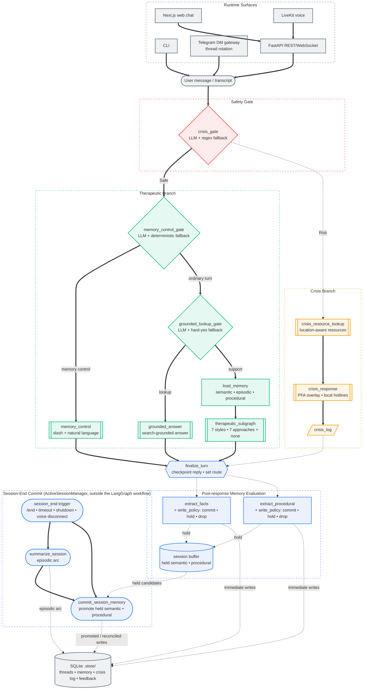

<div align="center">


**A mental health companion built around three things: memory across sessions, 13 guided exercises, and a crisis gate on every turn.**

[](https://python.org)
[](https://nextjs.org)
[](https://langchain-ai.github.io/langgraph/)
[](https://livekit.io/)
[](https://platform.openai.com/docs/guides/realtime)
[](https://fastapi.tiangolo.com/)
[](LICENSE)

</div>

> [!IMPORTANT]
> **Not a therapist. Not a diagnostic tool. Not an emergency service.**
> OpenCouch is a place to think out loud, work through guided exercises, and pick up where you left off. It is not a substitute for professional care.

> [!NOTE]
> **Active Development:** OpenCouch is currently maintained by a solo developer. While stability is a priority, please anticipate occasional breaking changes as the architecture and features evolve. Documentation may lag behind the code at times because the project moves quickly.

---

## Table of Contents
- [📖 Overview](#-overview)
- [✨ Key Features](#-key-features)
- [Screenshots](#screenshots)
- [🚀 Quick Start](#-quick-start)
  - [Prerequisites](#prerequisites)
  - [Environment](#environment)
  - [One-command local stack](#one-command-local-stack)
  - [Manual web stack](#manual-web-stack)
  - [CLI](#cli)
  - [Telegram Gateway](#telegram-gateway)
  - [Documentation Site](#documentation-site)
- [🧠 Architecture](#-architecture)
  - [Supported Surfaces](#supported-surfaces)
- [📁 Project Structure](#-project-structure)
- [🧪 Development \& Validation](#-development--validation)
  - [Observability](#observability)
- [📝 Changelog](#-changelog)
- [🤝 Contributing](#-contributing)
- [🗺️ Roadmap](#️-roadmap)

---

## 📖 Overview

The text runtime is a [LangGraph](https://langchain-ai.github.io/langgraph/) graph behind a FastAPI server, with SQLite for memory and audit trails. The web UI is Next.js.

Memory is split into three [CoALA](https://arxiv.org/abs/2309.02427)-inspired layers: semantic facts, episodic arcs, and procedural rules. Every turn passes through crisis safety routing before therapeutic generation, and the main routing decisions are covered by local evals plus Opik-first tracing.

Voice support is experimental and LiveKit-first in the web app. The browser joins a LiveKit room, a LiveKit Agents worker runs the speech loop, and OpenAI Realtime powers the low-latency model path. The older direct Realtime harness remains in the backend for experiments.

A closed beta is planned.

## ✨ Key Features
- Persistent memory across sessions: semantic facts, episodic arcs, procedural rules.
- Crisis gate runs before every response, with a SQLite audit trail.
- Local eval runners, plus Opik as the primary trace surface for regression tracking.
- LiveKit voice in the browser, backed by OpenAI Realtime — configurable voices, transcription hints, interruption handling.
- Telegram DM gateway with allow-listing, `/end`, markdown rendering, and session rotation.
- 13 guided exercises with multi-turn state tracking — grounding, breathing, thought work, values reflection, and others.

## Screenshots

<table>
  <tr>
    <td colspan="2" width="33%" align="center" valign="top"></td>
    <td colspan="2" width="33%" align="center" valign="top"></td>
    <td colspan="2" width="33%" align="center" valign="top"></td>
  </tr>
  <tr>
    <td width="16%"></td>
    <td colspan="2" width="33%" align="center" valign="top"></td>
    <td colspan="2" width="33%" align="center" valign="top"></td>
    <td width="16%"></td>
  </tr>
</table>

---

## 🚀 Quick Start

### Prerequisites
- Docker Desktop running for the one-command local stack.
- `uv` and `pnpm` for manual backend/web development.
- Provider keys only for real model runs. Deterministic CLI and many local checks can run without external API keys.

### Environment
OpenCouch loads local environment files from the repo root and `apps/backend` (`.env`, then `.env.local`). Deterministic mode does not need external API keys. Real model runs need at least one configured provider:

```env
# Text model provider. Defaults to openai when unset.
LLM_PROVIDER=openai
OPENAI_API_KEY=...

# Alternative text provider.
# LLM_PROVIDER=gemini
# GEMINI_API_KEY=...
# GOOGLE_API_KEY=...
```

Voice and Telegram are optional surfaces with additional configuration:

```env
# Web voice via LiveKit + OpenAI Realtime model.
LIVEKIT_URL=wss://your-project.livekit.cloud
LIVEKIT_API_KEY=...
LIVEKIT_API_SECRET=...
OPENAI_API_KEY=...

# Telegram dogfood gateway.
OPENCOUCH_TELEGRAM_BOT_TOKEN=123456:abc...
OPENCOUCH_TELEGRAM_ALLOW_FROM=123456789
OPENCOUCH_TELEGRAM_OWNER_ID=alice
OPENCOUCH_TELEGRAM_RESPONSE_MODEL_TIER=fast
```

Keep real `.env` files local and out of version control.

### One-command local stack
Use this for the full local web + voice **development** stack with backend reload and Next.js hot reload:

```bash
docker compose up --build
```

This starts:
- backend API: [localhost:8080/api/health](http://localhost:8080/api/health)
- LiveKit voice worker: `python -m voice.livekit.agent start`
- Next.js web UI in dev mode: [localhost:3000](http://localhost:3000)

The Compose stack reads `.env`, `.env.local`, `apps/backend/.env`, and `apps/backend/.env.local` when present. For browser voice, set `LIVEKIT_URL`, `LIVEKIT_API_KEY`, `LIVEKIT_API_SECRET`, and `OPENAI_API_KEY` before starting the stack.

For text-only development without LiveKit credentials, start just the API and hot-reload web UI:

```bash
docker compose up --build api web
```

For production-like web dogfooding, use the `web-prod` profile. This keeps the backend API in Compose but runs the web UI with `next build` + `next start`, which is closer to what users feel than `next dev`:

```bash
docker compose --profile prod-web up --build api web-prod
```

Stop everything with:

```bash
docker compose down
```

### Manual web stack
Use this when you want each process in its own terminal. The manual stack uses port `8000` for the API because the web client defaults to `http://localhost:8000/api`; the Compose stack uses container-friendly port `8080` and sets `NEXT_PUBLIC_API_URL` for the web container.

Terminal 1 — API server:
```bash
cd apps/backend
uv run uvicorn main:app --port 8000 --reload
```

Terminal 2 — frontend:
```bash
pnpm install
pnpm --dir apps/web dev
```

Open [localhost:3000](http://localhost:3000) in your browser.

Optional terminal 3 — LiveKit voice worker:
```bash
cd apps/backend
uv run python -m voice.livekit.agent start
```

### CLI
The CLI is the fastest way to interact with the backend locally.

```bash
cd apps/backend && uv sync

# Deterministic text mode: no API key needed.
uv run python -m opencouch_cli --mode deterministic --memory-mode guest --thread-id scratch

# Full text mode with persistent memory.
uv run python -m opencouch_cli --mode auto --memory-mode persistent --user-id alice --thread-id s1

# Voice mode: requires LiveKit env vars plus OPENAI_API_KEY.
uv run python -m opencouch_cli --voice
```

### Telegram Gateway
Run the standalone Telegram dogfood gateway. It does not require the FastAPI server.

```bash
cd apps/backend
OPENCOUCH_TELEGRAM_BOT_TOKEN="123456:abc..." \
OPENCOUCH_TELEGRAM_ALLOW_FROM="123456789" \
OPENCOUCH_TELEGRAM_OWNER_ID="alice" \
OPENCOUCH_TELEGRAM_RESPONSE_MODEL_TIER="fast" \
uv run python -m channels.gateway telegram
```

See [`apps/backend/README.md`](apps/backend/README.md) for backend-specific commands.

### Documentation Site

> **For developers and contributors only.** The hosted docs are available at the link below — running locally is only needed if you're editing documentation.

The official documentation is live at: **[https://whanyu1212.github.io/OpenCouch/](https://whanyu1212.github.io/OpenCouch/)**

To run the Docusaurus-powered docs site locally:

```bash
cd apps/docs
pnpm install && npx docusaurus start --port 3001
```

---

## 🧠 Architecture

Every turn passes through the crisis gate before therapeutic generation. Memory writes happen in two phases: per-turn extraction, then a runtime-coordinated session-end commit for episodic summaries and held candidates.

### Supported Surfaces

- **CLI:** Local text and voice harness for development and dogfooding.
- **Web chat:** Next.js text UI backed by FastAPI REST and WebSocket streaming routes.
- **Web voice:** LiveKit browser sessions with a LiveKit Agents worker and OpenAI Realtime model.
- **Telegram:** Direct-message gateway with allow-listing, markdown rendering, `/end`, and session rotation.
- **Backend API:** FastAPI route layer used by the web UI and integration surfaces.



---

## 📁 Project Structure

This repository is a monorepo managed with `uv` and `pnpm`.

<details>
<summary><b>View Repository Tree</b></summary>

```text
OpenCouch/
├── apps/
│   ├── backend/                # Python backend (FastAPI, LangGraph)
│   │   ├── agent/              # Conversation graph, nodes, state, runtime context
│   │   │   ├── nodes/          # Individual graph nodes
│   │   │   ├── memory/         # Memory retrieval, deduplication, embeddings
│   │   │   └── therapeutic/    # Therapeutic subgraph, modes, prompt logic
│   │   ├── services/llm/       # LLM adapters (Gemini, OpenAI, etc.)
│   │   ├── opencouch_cli/      # Interactive terminal CLI
│   │   ├── voice/              # LiveKit voice worker + direct Realtime harness
│   │   ├── channels/           # Telegram gateway and channel adapters
│   │   ├── api/                # FastAPI REST + WebSocket routes
│   │   └── tests/              # 1100+ pytest unit/integration tests
│   ├── web/                    # Next.js chat application
│   └── docs/                   # Docusaurus documentation site
└── eval/                       # Evaluation harnesses + curated datasets
```
</details>

---

## 🧪 Development & Validation

Backend:

```bash
cd apps/backend && uv sync --group dev

# Run the test suite before opening a PR.
uv run pytest tests/

# Run core deterministic evaluation checks.
uv run python ../../eval/runners/crisis_gate_eval.py --mode deterministic
uv run python ../../eval/runners/therapeutic_routing_eval.py --mode deterministic
```

Web:

```bash
pnpm install
pnpm --dir apps/web lint
pnpm --dir apps/web build
```

Repository hooks:

```bash
uv run pre-commit run --all-files
```

### Observability

For local development traces and eval review, add Opik credentials to `.env` before running the CLI or API:

```env
OPIK_API_KEY=...
OPIK_WORKSPACE=...
OPIK_PROJECT_NAME=opencouch-dev
```

LangSmith / LangChain tracing can be enabled as a secondary backend:

```env
LANGSMITH_TRACING=true
LANGSMITH_ENDPOINT=https://api.smith.langchain.com
LANGSMITH_API_KEY=...
LANGSMITH_PROJECT=opencouch-dev

LANGCHAIN_TRACING_V2=true
LANGCHAIN_ENDPOINT=https://api.smith.langchain.com
LANGCHAIN_API_KEY=...
LANGCHAIN_PROJECT=opencouch-dev
```

---

## 📝 Changelog

See [`CHANGELOG.md`](CHANGELOG.md) for the full history. Recent highlights:

- **Thin nodes, fat services refactor** — memory/session/crisis graph nodes now stay narrowly orchestration-focused while service modules own retrieval, episodic summarization, held-candidate promotion, and deterministic backstops; routing eval harnesses and Docusaurus architecture/state docs were updated to match the refactor, with hybrid routing evals passing for grounded lookup (`14/14`), memory control (`11/11`), and therapeutic routing (`54/54`).
- **Route-persistent text streaming** — active text replies keep streaming while you move between Chat, Voice, Memory, and State, and Voice start is blocked until the text turn finishes.
- **One-command local dev stack** — Docker Compose now starts the FastAPI backend, LiveKit voice worker, and Next.js web UI together with bind-mounted source and container-managed dependency caches.
- **OpenAI hybrid prompt stabilization** — text and LiveKit voice prompts now share tighter safety, support, closing, guided-exercise, and continuity behavior; ambiguous level-1 safety language asks a direct check without premature emergency-resource escalation, and the OpenAI hybrid eval sweep passes across routing, behavior, trajectory, memory, and voice runners.
- **Session experience refresh** — the web app now has a responsive session setup flow, desktop nav rail, mobile tab bar, session pill controls, refreshed chat/voice surfaces, and a lightweight memory-model diagram for persistent vs incognito sessions.
- **LiveKit prewarm path** — the voice worker preloads blocking VAD/runtime assets and supports a one-time first-output warmup request from the browser to reduce initial voice-session latency.
- **Therapeutic subgraph refactor** — dispatcher, guided-exercise, prompt-building, streaming, registry, and shared response-generation internals are split into focused modules while preserving compatibility imports.
- **LLM-primary routing and policy gates** — therapeutic routing, grounded lookup, memory control, memory write policy, exercise continuation, and exercise selection now use LLM classifiers first with deterministic fallbacks.
- **Guided exercise improvements** — 13 state-tracked exercises share a registry, ambiguous exercise requests can offer options instead of defaulting to grounding, and exercise eval coverage tracks selection, flow, and memory behavior.
- **Web UI hardening** — Next.js lint/build now run in CI, persisted session setup avoids hydration flashes, REST and WebSocket failures surface in the UI, and LiveKit voice loading is route-aware.
- **LiveKit voice path** — browser voice sessions use LiveKit token issuance, a LiveKit Agents worker, OpenAI Realtime model backing, transcript/finalization handling, and the existing crisis/memory runtime.
- **Telegram dogfood gateway** — direct-message support includes allow-listing, `/end`, Markdown-to-HTML rendering, session rotation, startup recovery, lease retry handling, and non-blocking sweeps.
- **Memory and audit cleanup** — memory internals, audit backends, extraction policy, and retrieval quality were reorganized for clearer subsystem boundaries and more stable eval behavior.
- **Regression coverage** — backend tests and deterministic/hybrid eval runners cover crisis, therapeutic routing, behavior, exercises, long trajectories, memory trajectories, summarization, extraction, and procedural writer checks.

---

## 🤝 Contributing

We welcome contributions. Run the relevant checks in [Development & Validation](#-development--validation) before submitting a Pull Request.

**Branch Conventions:**
- `feature/*` for new capabilities
- `fix/*` for bug fixes
- `refactor/*` for architectural changes
- `docs/*` for documentation updates

*(Note: All PRs should target the `develop` branch.)*

---

## 🗺️ Roadmap

| Status | Component | Initiative |
|:---|:---|:---|
| ✅ **Shipped** | **Web Frontend** | Next.js UI with chat, threading, and memory inspection |
| ✅ **Shipped** | **Voice Chat** | LiveKit voice sessions backed by OpenAI Realtime, crisis gate, and memory |
| ✅ **Shipped** | **Guided Exercises** | 13 interactive exercises with multi-turn state tracking |
| ✅ **Shipped** | **Session Feedback** | End-of-session rating system via UI and CLI |
| ✅ **Shipped** | **API Layer** | FastAPI REST + WebSocket streaming |
| ✅ **Dogfood** | **Telegram Gateway** | Direct-message gateway with allow-listing, Markdown rendering, and thread rotation |
| ⏳ **Planned** | **Additional Messaging Channels** | WhatsApp and Discord adapters |
| ⏳ **Planned** | **Graph Memory** | Graphiti + Neo4j for entity-relationship reasoning |
| ⏳ **Planned** | **Consolidation** | Background fact merging, dormant marking, and undo support |
| ⏳ **Planned** | **Acoustic Safety** | Paralinguistic crisis detection (prosodic flatness, etc.) |
| 🛑 **Blocked** | **Clinical Review** | Expert clinician audit of knowledge files and safety logic |

---

<div align="center">
<sub>AGPL-3.0. Not a substitute for professional care.</sub>
<br/>
<br/>
<a href="LICENSE">AGPL-3.0 License</a>
</div>
