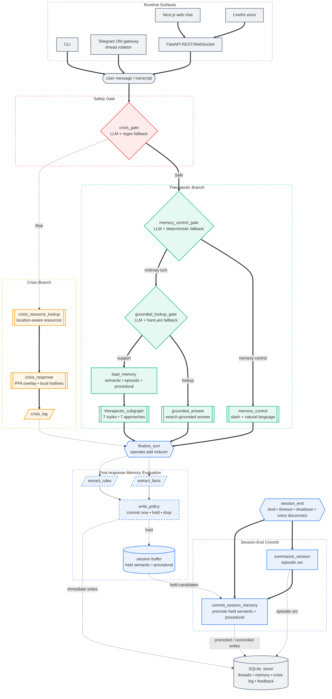

<div align="center">


# OpenCouch

**An open-source mental health support agent with persistent memory, crisis safety, and natural voice.**

[](https://python.org)
[](https://nextjs.org)
[](https://langchain-ai.github.io/langgraph/)
[](https://livekit.io/)
[](https://platform.openai.com/docs/guides/realtime)
[](https://fastapi.tiangolo.com/)
[](LICENSE)

[Documentation](https://whanyu1212.github.io/OpenCouch/) · [Quick Start](#quick-start) · [Architecture](#architecture) · [Roadmap](#roadmap)

<br/>

<p align="center">
  
</p>

</div>

> [!IMPORTANT]
> **Not a therapist. Not a diagnostic tool. Not an emergency service.**
> OpenCouch is a support assistant for difficult moments, reflective dialogue, and structured exercises, with memory continuity across sessions.

> [!NOTE]
> **Active Development:** OpenCouch is currently maintained by a solo developer. While stability is a priority, please anticipate occasional breaking changes as the architecture and features evolve. Documentation may lag behind the code at times because the project moves quickly.

---

## Table of Contents
- [📖 Overview](#-overview)
- [✨ Key Features](#-key-features)
- [🚀 Quick Start](#-quick-start)
  - [Environment](#environment)
  - [1. Command Line Interface (CLI)](#1-command-line-interface-cli)
  - [Eval-driven development](#eval-driven-development)
    - [Observability \& evaluation](#observability--evaluation)
  - [2. Web Interface](#2-web-interface)
  - [3. Telegram Gateway](#3-telegram-gateway)
  - [4. Documentation Site](#4-documentation-site)
- [🧠 Architecture](#-architecture)
  - [Supported Surfaces](#supported-surfaces)
- [📁 Project Structure](#-project-structure)
- [📝 Changelog](#-changelog)
- [🤝 Contributing](#-contributing)
  - [Development Setup](#development-setup)
- [🗺️ Roadmap](#️-roadmap)

---

## 📖 Overview

OpenCouch is an open-source support assistant for difficult moments, reflective dialogue, and structured exercises. The backend uses [LangGraph](https://langchain-ai.github.io/langgraph/) for the text runtime, FastAPI for APIs, and SQLite-backed persistence for memory and audit trails. The web UI is built with Next.js.

Memory is split into three [CoALA](https://arxiv.org/abs/2309.02427)-inspired layers: semantic facts, episodic arcs, and procedural rules. Every turn passes through crisis safety routing before therapeutic generation, and the main routing decisions are covered by local evals plus optional [LangSmith](https://www.langchain.com/langsmith) tracing.

Voice support is experimental and LiveKit-first in the web app. The browser joins a LiveKit room, a LiveKit Agents worker runs the speech loop, and OpenAI Realtime powers the low-latency model path. The older direct Realtime harness remains in the backend for experiments.

The project is still in active development. A close-beta rollout is planned, and production hardening is ongoing.

## ✨ Key Features

- **Persistent Memory:** Stores semantic facts, episodic session arcs, and procedural rules across sessions.
- **Safety by Default:** Evaluates every user input with a crisis gate before response generation, with a persistent audit trail.
- **Traceable Execution:** Uses LangSmith to inspect graph execution, route selection, and per-turn text traces.
- **Evaluation-Ready:** Combines local eval runners with LangSmith projects for regression tracking and failure analysis.
- **LiveKit Voice:** Supports low-latency speech conversations through LiveKit sessions backed by OpenAI Realtime, with configurable voices, transcription language hints, and interruption handling.
- **Telegram DM Gateway:** Runs a dogfood Telegram channel with session rotation, markdown rendering, allow-listing, and `/end` session closure.
- **Guided Exercises:** Provides 13 multi-turn, state-tracked exercises for grounding, breathing, thought work, values reflection, and related structured practice.

---

## 🚀 Quick Start

### Environment
OpenCouch loads local environment files from the repo root and `apps/backend` (`.env`, then `.env.local`). Deterministic mode does not need external API keys. Real model runs need at least one configured provider:

```env
# Text model provider. Defaults to openai when unset.
LLM_PROVIDER=openai
OPENAI_API_KEY=...

# Alternative text provider.
# LLM_PROVIDER=gemini
# GEMINI_API_KEY=...
# GOOGLE_API_KEY=...
```

Voice and Telegram are optional surfaces with additional configuration:

```env
# Web voice via LiveKit + OpenAI Realtime model.
LIVEKIT_URL=wss://your-project.livekit.cloud
LIVEKIT_API_KEY=...
LIVEKIT_API_SECRET=...
OPENAI_API_KEY=...

# Telegram dogfood gateway.
OPENCOUCH_TELEGRAM_BOT_TOKEN=123456:abc...
OPENCOUCH_TELEGRAM_ALLOW_FROM=123456789
OPENCOUCH_TELEGRAM_OWNER_ID=alice
OPENCOUCH_TELEGRAM_RESPONSE_MODEL_TIER=fast
```

Keep real `.env` files local and out of version control.

### 1. Command Line Interface (CLI)
The CLI provides the fastest way to interact with OpenCouch locally.

```bash
cd apps/backend && uv sync

# Deterministic text mode (No API key needed, useful for local validation)
uv run python -m opencouch_cli --mode deterministic --memory-mode guest --thread-id scratch

# Full text mode with persistent memory (Requires provider API keys)
uv run python -m opencouch_cli --mode auto --memory-mode persistent --user-id alice --thread-id s1

# Voice mode (Requires LiveKit env vars plus OPENAI_API_KEY)
uv run python -m opencouch_cli --voice
```

### Eval-driven development

> **For developers and contributors only.** End users do not need to configure this section — it powers internal observability and regression tracking during development.

#### Observability & evaluation

To enable LangSmith-backed observability and evaluation for local text runs, add the following to `.env` before running the CLI or API:

```env
LANGSMITH_TRACING=true
LANGSMITH_ENDPOINT=https://api.smith.langchain.com
LANGSMITH_API_KEY=...
LANGSMITH_PROJECT=opencouch-dev

LANGCHAIN_TRACING_V2=true
LANGCHAIN_ENDPOINT=https://api.smith.langchain.com
LANGCHAIN_API_KEY=...
LANGCHAIN_PROJECT=opencouch-dev
```

### 2. Web Interface
Run the full stack with the Next.js frontend and FastAPI backend.

**Terminal 1 — API Server:**
```bash
cd apps/backend
uv run uvicorn main:app --port 8000 --reload
```

**Terminal 2 — Frontend:**
```bash
# From the repository root
pnpm install
pnpm --dir apps/web dev
```
Open [localhost:3000](http://localhost:3000) in your browser.

**Optional Terminal 3 — LiveKit Voice Worker:**
```bash
cd apps/backend
uv run python -m voice.livekit.agent dev
```

### 3. Telegram Gateway
Run the standalone Telegram dogfood gateway. It does not require the FastAPI server.

```bash
cd apps/backend
OPENCOUCH_TELEGRAM_BOT_TOKEN="123456:abc..." \
OPENCOUCH_TELEGRAM_ALLOW_FROM="123456789" \
OPENCOUCH_TELEGRAM_OWNER_ID="alice" \
OPENCOUCH_TELEGRAM_RESPONSE_MODEL_TIER="fast" \
uv run python -m channels.gateway telegram
```

See [`apps/backend/README.md`](apps/backend/README.md) for backend-specific commands.

### 4. Documentation Site

> **For developers and contributors only.** The hosted docs are available at the link below — running locally is only needed if you're editing documentation.

The official documentation is live at: **[https://whanyu1212.github.io/OpenCouch/](https://whanyu1212.github.io/OpenCouch/)**

To run the Docusaurus-powered docs site locally:

```bash
cd apps/docs
pnpm install && npx docusaurus start --port 3001
```

---

## 🧠 Architecture

OpenCouch uses a directed graph that enforces safety checks before therapeutic generation, then runs post-response memory evaluation on each turn and a separate session-end commit seam for episodic and buffered memory.

### Supported Surfaces

- **CLI:** Local text and voice harness for development and dogfooding.
- **Web chat:** Next.js text UI backed by FastAPI REST and WebSocket streaming routes.
- **Web voice:** LiveKit browser sessions with a LiveKit Agents worker and OpenAI Realtime model.
- **Telegram:** Direct-message gateway with allow-listing, markdown rendering, `/end`, and session rotation.
- **Backend API:** FastAPI route layer used by the web UI and integration surfaces.



---

## 📁 Project Structure

This repository is a monorepo managed with `uv` and `pnpm`.

<details>
<summary><b>View Repository Tree</b></summary>

```text
OpenCouch/
├── apps/
│   ├── backend/                # Python backend (FastAPI, LangGraph)
│   │   ├── agent/              # Conversation graph, nodes, state, runtime context
│   │   │   ├── nodes/          # Individual graph nodes
│   │   │   ├── memory/         # Memory retrieval, deduplication, embeddings
│   │   │   └── therapeutic/    # Therapeutic subgraph, modes, prompt logic
│   │   ├── services/llm/       # LLM adapters (Gemini, OpenAI, etc.)
│   │   ├── opencouch_cli/      # Interactive terminal CLI
│   │   ├── voice/              # LiveKit voice worker + direct Realtime harness
│   │   ├── channels/           # Telegram gateway and channel adapters
│   │   ├── api/                # FastAPI REST + WebSocket routes
│   │   └── tests/              # 1100+ pytest unit/integration tests
│   ├── web/                    # Next.js chat application
│   └── docs/                   # Docusaurus documentation site
└── eval/                       # Evaluation harnesses + curated datasets
```
</details>

---

## 📝 Changelog

See [`CHANGELOG.md`](CHANGELOG.md) for the full history. Recent highlights:

- **Therapeutic subgraph refactor** — dispatcher, guided-exercise, prompt-building, streaming, registry, and shared response-generation internals are split into focused modules while preserving compatibility imports.
- **LLM-primary routing and policy gates** — therapeutic routing, grounded lookup, memory control, memory write policy, exercise continuation, and exercise selection now use LLM classifiers first with deterministic fallbacks.
- **Guided exercise improvements** — 13 state-tracked exercises share a registry, ambiguous exercise requests can offer options instead of defaulting to grounding, and exercise eval coverage tracks selection, flow, and memory behavior.
- **Web UI hardening** — Next.js lint/build now run in CI, persisted session setup avoids hydration flashes, REST and WebSocket failures surface in the UI, and LiveKit voice loading is route-aware.
- **LiveKit voice path** — browser voice sessions use LiveKit token issuance, a LiveKit Agents worker, OpenAI Realtime model backing, transcript/finalization handling, and the existing crisis/memory runtime.
- **Telegram dogfood gateway** — direct-message support includes allow-listing, `/end`, Markdown-to-HTML rendering, session rotation, startup recovery, lease retry handling, and non-blocking sweeps.
- **Memory and audit cleanup** — memory internals, audit backends, extraction policy, and retrieval quality were reorganized for clearer subsystem boundaries and more stable eval behavior.
- **Regression coverage** — backend tests and deterministic/hybrid eval runners cover crisis, therapeutic routing, behavior, exercises, long trajectories, memory trajectories, summarization, extraction, and procedural writer checks.

---

## 🤝 Contributing

We welcome contributions. Please review the contribution guidelines before submitting a Pull Request.

### Development Setup

Backend:

```bash
cd apps/backend && uv sync --group dev

# Run the test suite (must pass before opening a PR)
uv run pytest tests/

# Run evaluation checks
uv run python ../../eval/runners/crisis_gate_eval.py --mode deterministic
uv run python ../../eval/runners/therapeutic_routing_eval.py --mode deterministic
```

Web:

```bash
# From the repository root
pnpm install
pnpm --dir apps/web lint
pnpm --dir apps/web build
```

Repository hooks:

```bash
# Run linters and formatters
pre-commit run --all-files
```

**Branch Conventions:**
- `feature/*` for new capabilities
- `fix/*` for bug fixes
- `refactor/*` for architectural changes
- `docs/*` for documentation updates

*(Note: All PRs should target the `develop` branch.)*

---

## 🗺️ Roadmap

| Status | Component | Initiative |
|:---|:---|:---|
| ✅ **Shipped** | **Web Frontend** | Next.js UI with chat, threading, and memory inspection |
| ✅ **Shipped** | **Voice Chat** | LiveKit voice sessions backed by OpenAI Realtime, crisis gate, and memory |
| ✅ **Shipped** | **Guided Exercises** | 13 interactive exercises with multi-turn state tracking |
| ✅ **Shipped** | **Session Feedback** | End-of-session rating system via UI and CLI |
| ✅ **Shipped** | **API Layer** | FastAPI REST + WebSocket streaming |
| ✅ **Dogfood** | **Telegram Gateway** | Direct-message gateway with allow-listing, Markdown rendering, and thread rotation |
| ⏳ **Planned** | **Additional Messaging Channels** | WhatsApp and Discord adapters |
| ⏳ **Planned** | **Graph Memory** | Graphiti + Neo4j for entity-relationship reasoning |
| ⏳ **Planned** | **Consolidation** | Background fact merging, dormant marking, and undo support |
| ⏳ **Planned** | **Acoustic Safety** | Paralinguistic crisis detection (prosodic flatness, etc.) |
| 🛑 **Blocked** | **Clinical Review** | Expert clinician audit of knowledge files and safety logic |

---

<div align="center">
<sub>Built responsibly. Use responsibly.</sub>
<br/>
<br/>
<a href="LICENSE">AGPL-3.0 License</a>
</div>
