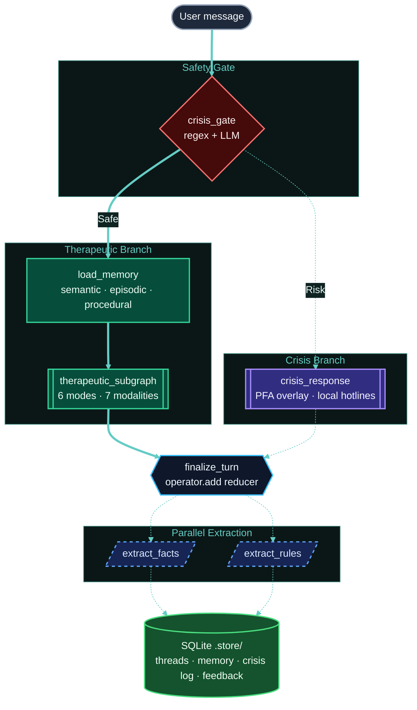

<div align="center">


# OpenCouch

**An open-source mental health support agent with persistent memory, crisis safety, and natural voice.**

[](https://python.org)
[](https://nextjs.org)
[](https://langchain-ai.github.io/langgraph/)
[](https://platform.openai.com/docs/guides/realtime)
[](https://fastapi.tiangolo.com/)
[](LICENSE)

[Documentation](https://whanyu1212.github.io/OpenCouch/) · [Quick Start](#quick-start) · [Architecture](#architecture) · [Roadmap](#roadmap)

<br/>

<!-- Add a product screenshot or demo GIF here -->
<!--  -->

> [!IMPORTANT]
> **Not a therapist. Not a diagnostic tool. Not an emergency service.**
> OpenCouch is a support assistant for difficult moments, reflective dialogue, and structured exercises, with memory continuity across sessions.

</div>

---

## Table of Contents
- [Overview](#overview)
- [Key Features](#key-features)
- [Quick Start](#quick-start)
- [Architecture](#architecture)
- [Project Structure](#project-structure)
- [Contributing](#contributing)
- [Changelog](#changelog)
- [Roadmap](#roadmap)

---

## Overview

OpenCouch is a conversational support agent built on [LangGraph](https://langchain-ai.github.io/langgraph/) for text orchestration and the [OpenAI Realtime API](https://platform.openai.com/docs/guides/realtime) for low-latency voice. It supports eval-driven development with [LangSmith](https://www.langchain.com/langsmith) for observability and evaluation across the text graph.

It uses three [CoALA](https://arxiv.org/abs/2309.02427)-inspired memory layers (semantic facts, episodic arcs, and procedural rules) to retain continuity across sessions. An **always-on crisis safety gate**, six therapeutic response modes, and seven LLM-routed modalities keep responses safe, grounded, and adaptive.

## Key Features

- **Persistent Memory:** Stores semantic facts, episodic session arcs, and procedural rules across sessions.
- **Safety by Default:** Evaluates every user input with a crisis gate before response generation, with a persistent audit trail.
- **Traceable Execution:** Uses LangSmith to inspect graph execution, route selection, and per-turn text traces.
- **Evaluation-Ready:** Combines local eval runners with LangSmith projects for regression tracking and failure analysis.
- **Multimodal Interaction:** Supports text, web, and natural voice conversations (~300ms via OpenAI Realtime).
- **Guided Exercises:** Provides multi-turn, state-tracked exercises (e.g., grounding and reflection) for structured practice.

---

## Quick Start

### 1. Command Line Interface (CLI)
The CLI provides the fastest way to interact with OpenCouch locally.

```bash
cd apps/backend && uv sync

# Deterministic text mode (No API key needed, useful for local validation)
uv run python -m opencouch_cli --mode deterministic --memory-mode guest --thread-id scratch

# Full text mode with persistent memory (Requires provider API keys)
uv run python -m opencouch_cli --mode auto --memory-mode persistent --user-id alice --thread-id s1

# Voice mode (Requires OPENAI_API_KEY in .env.local)
uv run python -m opencouch_cli --voice
```

### Eval-driven development

#### Observability & evaluation

To enable LangSmith-backed observability and evaluation for local text runs, add the following to `.env` before running the CLI or API:

```env
LANGSMITH_TRACING=true
LANGSMITH_ENDPOINT=https://api.smith.langchain.com
LANGSMITH_API_KEY=...
LANGSMITH_PROJECT=opencouch-dev

LANGCHAIN_TRACING_V2=true
LANGCHAIN_ENDPOINT=https://api.smith.langchain.com
LANGCHAIN_API_KEY=...
LANGCHAIN_PROJECT=opencouch-dev
```

### 2. Web Interface
Run the full stack with the Next.js frontend and FastAPI backend.

**Terminal 1 — API Server:**
```bash
cd apps/backend
uv run uvicorn main:app --port 8000 --reload
```

**Terminal 2 — Frontend:**
```bash
cd apps/web
pnpm install && pnpm dev
```
Open [localhost:3000](http://localhost:3000) in your browser.

### 3. Documentation Site
Run the Docusaurus-powered docs site locally.

```bash
cd apps/docs
pnpm install && npx docusaurus start --port 3001
```

---

## Architecture

OpenCouch uses a directed graph that enforces safety checks before therapeutic generation and runs memory extraction after each finalized turn.



---

## Project Structure

This repository is a monorepo managed with `uv` and `pnpm`.

```text
OpenCouch/
├── apps/
│   ├── backend/                # Python backend (FastAPI, LangGraph)
│   │   ├── agent/              # Conversation graph, nodes, state, runtime context
│   │   │   ├── nodes/          # Individual graph nodes
│   │   │   ├── memory/         # Memory retrieval, deduplication, embeddings
│   │   │   └── therapeutic/    # Therapeutic subgraph, modes, prompt logic
│   │   ├── services/llm/       # LLM adapters (Gemini, OpenAI, etc.)
│   │   ├── opencouch_cli/      # Interactive terminal CLI
│   │   ├── voice/              # OpenAI Realtime voice handlers
│   │   ├── api/                # FastAPI REST + WebSocket routes
│   │   └── tests/              # 630+ pytest unit/integration tests
│   ├── web/                    # Next.js chat application
│   └── docs/                   # Docusaurus documentation site
├── eval/                       # Evaluation harnesses + curated datasets
└── knowledge/                  # Therapeutic prompts, policy, and source-of-truth content
```

---

## Changelog

See [`CHANGELOG.md`](CHANGELOG.md) for the full history. Recent highlights:

- **Voice session persistence** — voice chat now survives in-app tab switches and browser tab backgrounding
- **Session trajectory evals** — unified eval runner with 25 long-trajectory cases covering safety, modality, and mode transitions
- **Crisis gate hardening** — LLM-primary architecture with regex fallback, shadow monitoring, and adversarial-resistant prompt
- **Therapeutic dispatcher rewrite** — LLM-primary routing for all 6 modes and 7 modalities, mid-exercise exit detection

---

## Contributing

We welcome contributions. Please review the contribution guidelines before submitting a Pull Request.

### Development Setup

```bash
cd apps/backend && uv sync --group dev

# Run the test suite (must pass before opening a PR)
uv run pytest tests/

# Run evaluation checks
uv run python eval/runners/crisis_gate_eval.py --mode deterministic
uv run python eval/runners/therapeutic_routing_eval.py --mode deterministic

# Run linters and formatters
pre-commit run --all-files
```

**Branch Conventions:**
- `feature/*` for new capabilities
- `fix/*` for bug fixes
- `refactor/*` for architectural changes
- `docs/*` for documentation updates

*(Note: All PRs should target the `develop` branch.)*

---

## Roadmap

| Status | Component | Initiative |
|:---|:---|:---|
| ✓ Shipped | **Web Frontend** | Next.js UI with chat, threading, and memory inspection |
| ✓ Shipped | **Voice Chat** | OpenAI Realtime integration with crisis gate and memory |
| ✓ Shipped | **Guided Exercises** | 12 interactive exercises with multi-turn state tracking |
| ✓ Shipped | **Session Feedback** | End-of-session rating system via UI and CLI |
| ✓ Shipped | **API Layer** | FastAPI REST + WebSocket streaming |
| ○ Planned | **Messaging Channels** | Adapters for Telegram, WhatsApp, and Discord |
| ○ Planned | **Graph Memory** | Graphiti + Neo4j for entity-relationship reasoning |
| ○ Planned | **Consolidation** | Background fact merging, dormant marking, and undo support |
| ○ Planned | **Acoustic Safety** | Paralinguistic crisis detection (prosodic flatness, etc.) |
| ⏸ Blocked | **Clinical Review** | Expert clinician audit of knowledge files and safety logic |

---

<div align="center">
<sub>Built responsibly. Use responsibly.</sub>
<br/>
<br/>
<a href="LICENSE">AGPL-3.0 License</a>
</div>
