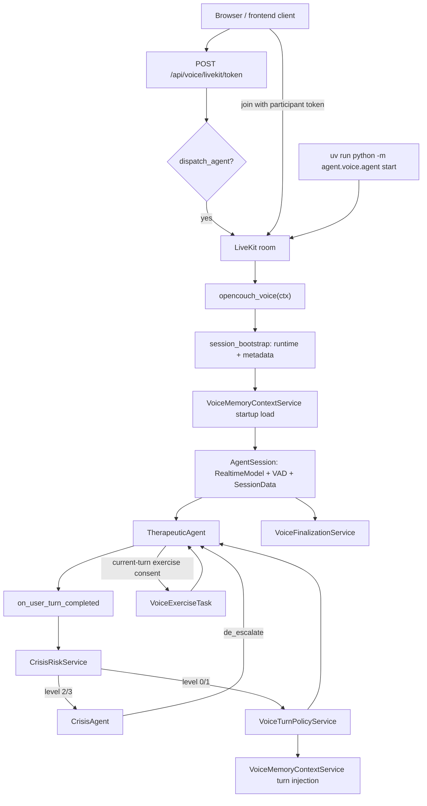

# LiveKit Voice Agent

This package contains the LiveKit-native voice runtime for OpenCouch.

The important boundary is:

- LiveKit owns room transport, realtime audio, `AgentSession`, lifecycle hooks, true agent handoffs, and bounded `AgentTask`s.
- OpenCouch plain services own product behavior: crisis classification, turn policy, memory context, exercise consent, grounded lookup, and transcript finalization.

## Runtime Topology

## File Map

- `agent.py`: LiveKit worker entrypoint and session wiring only.
- `agents.py`: the two LiveKit agents: `TherapeuticAgent` and `CrisisAgent`.
- `tasks.py`: `VoiceExerciseTask`, the one bounded exercise task.
- `turn_policy.py`: LLM-primary voice turn policy.
- `memory_context.py`: startup memory loading and mid-session memory injection.
- `session_bootstrap.py`: runtime singleton, metadata resolution, realtime model setup, and turn handling setup.
- `transcript_finalizer.py`: idempotent transcript-derived memory persistence on session end.
- `tools.py`: LiveKit function tools for explicit memory control, grounded lookup, and crisis resource lookup.
- `routes.py`: FastAPI token and finalization-status routes.
- `activity.py`: sanitized room-data events for frontend activity indicators.

## LiveKit Boundaries

There are exactly two LiveKit agents in v1:

- `TherapeuticAgent`: default conversation agent.
- `CrisisAgent`: crisis-only agent with a narrower safety posture and tool surface.

Therapeutic modes such as holding, reflecting, understanding, and technique are not separate agents. They are turn-level guidance produced by `VoiceTurnPolicyService` and injected into the current turn context.

There is one task type:

- `VoiceExerciseTask`: a bounded guided exercise flow that takes control only while the exercise is active and returns an `ExerciseResult` to `TherapeuticAgent`.

Add another LiveKit agent only when there is a true lifecycle boundary: different safety rules, different tool permissions, or different context-retention needs.

## Turn Flow

For each completed user turn, `TherapeuticAgent.on_user_turn_completed()` runs:

1. `CrisisRiskService` classifies the turn with the control LLM.
2. Level 2 or 3 crisis immediately hands off to `CrisisAgent`.
3. Level 1 injects one clarification instruction and stays in `TherapeuticAgent`.
4. Level 0 calls `VoiceTurnPolicyService` for therapeutic posture and exercise consent.
5. Relevant prior memory may be injected when proactive recall is enabled.

There is no regex crisis safety net, regex exercise consent, or deterministic therapeutic intent router in the voice path. Missing control LLM configuration is an error, not a silent fallback.

## Exercises

`VoiceExerciseTask` uses the shared therapeutic exercise registry but exposes only voice-suitable exercises for spoken turns. Typed room input can use the broader text exercise registry.

The parent model may call `start_grounding_exercise()` only when the current-turn policy has granted exercise consent. The task still validates the exact exercise id locally so an unsupported id cannot run.

Inside the task:

- `complete_step()` advances one step.
- `exit_exercise()` exits early when the user wants to stop or move away.
- The task returns to `TherapeuticAgent` after completion or exit.

## Memory

Startup memory is loaded before the realtime session starts:

- semantic facts;
- episodic arcs;
- procedural preferences;
- proactive recall setting.

Mid-session memory injection is only used when proactive recall is on. The service injects unseen relevant facts into the current turn context and tracks injected keys in `SessionData`.

Ordinary durable memory writes are not a realtime function tool. Transcript/session-end extraction remains the default path for saving user facts. Explicit memory-control tools still support listing, status, proactive recall toggles, and confirmed deletion.

## Crisis

Voice crisis handling reuses the shared LLM-backed `CrisisRiskService`.

- Level 0: normal therapeutic flow.
- Level 1: ask one direct safety clarification, no full crisis handoff.
- Level 2/3: hand off to `CrisisAgent`.

`CrisisAgent` can call `provide_crisis_resources()` for verified local resources. It must not invent hotline numbers or infer location.

## Finalization

`VoiceFinalizationService` runs at session close or job shutdown and finalizes each voice session at most once. It:

- writes `in_progress`, `completed`, or `failed` finalization status;
- skips durable memory writes for incognito sessions;
- serializes only user/assistant dialogue;
- calls the shared runtime transcript finalization path.

Console sessions skip transcript finalization by default unless `OPENCOUCH_VOICE_CONSOLE_FINALIZE_ON_EXIT=true`.

## Testing

The fast test layer uses LiveKit's text-only `AgentSession.run()` behavior path. These tests validate tool calls, handoffs, task entry guards, session userdata continuity, memory control, and grounded lookup.

They do not exercise a real room, STT, VAD, or audio output. A small live room/audio smoke path should be kept separate for dogfooding and deployment checks.
