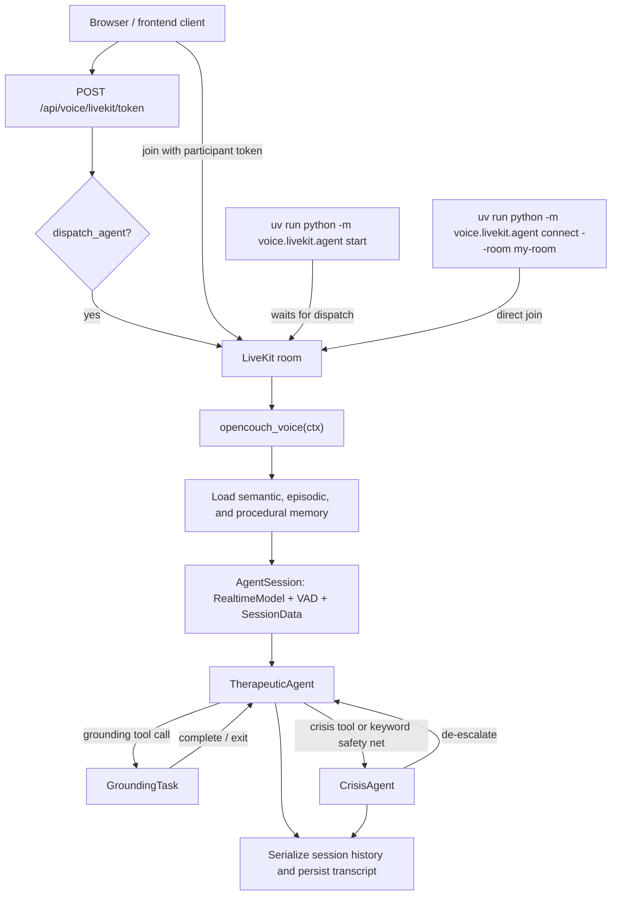

# LiveKit Voice Agent

This package contains the LiveKit-native voice runtime for OpenCouch.

At a high level:

- LiveKit handles room transport, audio I/O, and agent dispatch.
- `voice.livekit.agent` owns the worker, session setup, handoffs, and shutdown persistence.
- `voice.realtime.build_voice_system_prompt()` provides the compact therapeutic system prompt used at session start.
- Session memory is loaded into the prompt at startup, selectively injected again mid-session, and persisted on shutdown.

## File Map

- `agent.py`: worker entrypoint, session bootstrap, `TherapeuticAgent`, `CrisisAgent`, memory loading, and shutdown persistence.
- `activity.py`: sanitized room-data events for frontend activity indicators.
- `api.py`: FastAPI routes for room tokens and the standalone browser test page. The router is defined at `/voice/livekit` and mounted by the backend under `/api`, so the effective local paths are `/api/voice/livekit/...`.
- `session_data.py`: typed per-session state shared across agents, tools, and tasks.
- `tools.py`: shared function tools such as `save_insight()` and `crisis_check()`.
- `tasks.py`: `GroundingTask`, a bounded voice exercise task that the main agent can enter and return from.
- `test_page.html`: simple browser room client for local testing.

## Runtime Model

There are two important lifetimes in this package:

- Worker lifetime: `_ensure_runtime()` lazily creates a shared durable `PersistentAgentRuntime` once per worker process. That runtime owns the configured persistence layer (Postgres recommended, SQLite legacy fallback) and the optional control-model client used for session-end extraction.
- Session lifetime: each LiveKit job creates one `AgentSession[SessionData]` for one room conversation. `SessionData` is the in-memory state object shared across the default agent, crisis agent, tools, and tasks for the duration of that job. The effective memory mode is resolved per session from token metadata, participant metadata, or `OPENCOUCH_MEMORY_MODE`.

The session itself is created in `opencouch_voice()` with:

- `openai.realtime.RealtimeModel(voice="cedar")`
- `silero.VAD.load()`
- `SessionData(...)` carrying user identity, memory references, crisis state, prompt state, and recent exercise history

The voice worker also publishes sanitized `opencouch.voice_activity` room-data
events for frontend status chips. These events report lifecycle markers such as
memory saved, lookup used, crisis resources searched, and exercise active. They
do not include raw memory content, private crisis text, search queries, or
credentials.

## Room Routing

There are two supported ways to get the agent into a room.

### 1. Token-dispatch flow

This is the normal browser/frontend path.

1. A client calls `POST /api/voice/livekit/token`.
2. `api.py` creates a participant token for a room and embeds `RoomAgentDispatch(agent_name="opencouch-voice")` when `dispatch_agent=True`.
3. When the client joins the room with that token, LiveKit dispatches the agent named `opencouch-voice`.
4. LiveKit invokes `@server.rtc_session(agent_name="opencouch-voice")` in `agent.py`.
5. `opencouch_voice()` connects to the room, reads `user_id` and `thread_id` from job metadata or participant metadata, loads memory, and starts the session.

This is the mode to use with `uv run python -m voice.livekit.agent start`.

### 2. Direct connect flow

This is the manual room-join path.

1. Run `uv run python -m voice.livekit.agent connect --room <room-name>`.
2. The agent joins that room directly as a participant.
3. A browser or other client must join the same room separately.

In this mode you usually want `dispatch_agent=false` on the browser token request, otherwise the room will contain both:

- the directly connected agent participant
- the token-dispatched agent

That is why the local test page exposes a dispatch toggle.

## In-Session Routing

The conversation does not use a separate router graph. Routing is done with LiveKit agent handoffs and tasks.



```text
TherapeuticAgent
  -> GroundingTask     when the model chooses a structured exercise
  -> CrisisAgent       when crisis_check() escalates or the safety net fires

CrisisAgent
  -> TherapeuticAgent  when de_escalate() is called
```

### TherapeuticAgent

`TherapeuticAgent` is the default session agent.

Responsibilities:

- greet the user on session start
- hold the main therapeutic conversation
- use `save_insight()` to write durable semantic memory
- use memory-control tools to show memory, report status, toggle proactive recall, and confirm saved-memory deletion
- use `crisis_check()` when the model believes the user may be unsafe
- use `start_grounding_exercise()` when the user wants a grounding, breathing, or calming exercise
- run an `on_user_turn_completed()` safety/memory hook after each user turn

The post-turn hook does two deterministic things:

- crisis safety net: `matches_crisis_keywords()` can force an immediate `session.update_agent(CrisisAgent(...))` without waiting for the model to decide
- mid-session semantic retrieval: when proactive recall is enabled, the latest user turn is used to fetch a few relevant prior facts, and any new facts are injected into the chat context via `update_chat_ctx()`

### GroundingTask

`GroundingTask` is not a full alternate agent for open-ended conversation. It is a bounded task for voice-friendly exercises.

Properties:

- built from the existing exercise registry in `agent/therapeutic/guided_exercise.py`
- started from `TherapeuticAgent.start_grounding_exercise()`
- receives carried-over conversational context, but not prior instructions or tool-call noise
- owns the interaction until the user completes or exits the exercise

Within the task:

- `complete_step()` advances one exercise step at a time
- `exit_exercise()` stops the exercise early
- completion returns an `ExerciseResult` to the parent agent

Generic exercise requests are intentionally diversified. If the user keeps saying things like “help me calm down” without naming a specific technique, the task rotates away from recently used defaults instead of repeating the same exercise every time.

### CrisisAgent

`CrisisAgent` is a narrow crisis-support mode.

It is entered from either:

- the shared `crisis_check()` tool when the model flags moderate or severe risk
- the deterministic safety-net keyword match in `TherapeuticAgent.on_user_turn_completed()`

Its priorities are intentionally narrower than the main agent:

- acknowledge risk
- provide crisis resources
- look up verified local crisis resources when the user states a location
- stay present
- avoid normal therapeutic exploration

When the user has clearly stabilized, `de_escalate()` returns control to a fresh `TherapeuticAgent` using the original therapeutic instructions captured at session start.

## Defined Tasks

The LiveKit layer currently defines one actual `AgentTask`:

- `GroundingTask`

`GroundingTask` is started from `TherapeuticAgent.start_grounding_exercise()` and wraps a subset of the older guided exercise registry into a bounded, voice-first task flow.

### Voice-enabled exercise variants

These are the exercise types currently intended to run through `GroundingTask` in LiveKit voice mode:

- `grounding_5_4_3_2_1`
- `grounding_box_breathing`
- `grounding_stop_technique`
- `grounding_muscle_relaxation`
- `behavioral_activation_tiny_action`
- `self_compassion_break`
- `emotion_regulation_improve`
- `defusion_values_compass`
- `thought_work_continuum`
- `emotion_regulation_gratitude`

These fall into two practical groups:

- grounding and breathing: `5-4-3-2-1`, `box breathing`, `STOP`, `muscle relaxation`
- low-visual-load spoken exercises: `tiny action`, `self-compassion`, `IMPROVE`, `values compass`, `continuum`, `gratitude`

### Underlying registry vs LiveKit task support

The underlying exercise registry in `agent/therapeutic/guided_exercise.py` is larger than the LiveKit voice task surface. It also contains exercise types such as:

- `thought_work_simple_record`
- `defusion_leaves_on_stream`
- `thought_work_behavioral_experiment`

Those exist in the shared registry, but they are not currently exposed as distinct spoken task experiences in the LiveKit layer. Spoken turns still fall back to `grounding_5_4_3_2_1` when task resolution lands on a non-voice-suitable exercise.

The voice allowlist intentionally excludes visually loaded imagery such as
`defusion_leaves_on_stream` for now. Spoken sessions prioritize exercises that
can be followed without reading the screen or holding a detailed visual scene.

Typed turns are handled differently. The LiveKit session tracks whether the latest turn came from room text input or spoken audio:

- spoken turns stay on the voice-safe exercise subset
- typed turns can select from the broader exercise registry

### What is not a task

Two nearby concepts are easy to confuse with tasks:

- `TherapeuticAgent` is the default session agent, not a task.
- `CrisisAgent` is an agent handoff target, not a task.

So the current runtime shape is:

- main agent: `TherapeuticAgent`
- bounded task: `GroundingTask`
- crisis handoff agent: `CrisisAgent`

## Prompting Model

There are three prompt layers in play.

### 1. Base therapeutic prompt

The main system prompt is built by `voice.realtime.build_voice_system_prompt()`.

That prompt is intentionally compact because OpenAI Realtime sessions have a tighter instruction budget than the older websocket implementation. The prompt includes:

- core identity and response style
- safety boundaries
- optional procedural memory as “User preferences”
- optional semantic memory as “Known context about the user”
- optional episodic memory as “Relevant prior sessions”

The built prompt is captured in `SessionData.therapeutic_instructions` so it can be restored after crisis de-escalation.

### 2. Situational prompt nudges

Agents add short situational instructions on entry:

- `TherapeuticAgent.on_enter()` gives a brief opening-greeting instruction
- `CrisisAgent.on_enter()` gives a brief crisis-response instruction

These are small runtime nudges, not a replacement for the main system prompt.

### 3. Task-scoped exercise prompts

`GroundingTask` generates a dedicated instructions block for the selected exercise. That block includes:

- the full step plan
- pacing rules
- completion criteria
- exit behavior

The task prompt tells the model to deliver exactly one step at a time and wait for user engagement before advancing.

## Memory Model

Memory is used in three phases.

### 1. Startup load

At session start, `opencouch_voice()` loads compact memory from the shared store when the session memory mode is persistent:

- semantic facts
- episodic arcs
- procedural rules
- proactive recall state

These are passed into `build_voice_system_prompt()` before the session starts.

### 2. Mid-session retrieval

After each user turn, `TherapeuticAgent.on_user_turn_completed()` does a small semantic search using the latest user text.

Important behavior:

- only a few relevant facts are fetched
- already injected facts are skipped using `SessionData.injected_semantic_memory_keys`
- retrieved facts are injected as a system message via `update_chat_ctx()`
- only conversational context is carried across handoffs; prior instructions and function-call artifacts are excluded

### 3. Session-end persistence

On shutdown, the session serializes `session.history` into a simple transcript containing only user and assistant messages. That transcript is handed to `runtime.end_transcript_session(...)`, which is responsible for longer-lived persistence and extraction work outside the in-memory session.

The shutdown path also passes `max_crisis_level`, not just the current crisis level, so downstream processing can see the peak severity reached during the session.

## Shared Session State

`SessionData` is the glue object shared by agents, tools, and tasks.

It currently tracks:

- `user_id`
- `thread_id`
- `memory_store`
- `memory_mode`
- `llm_client`
- `proactive_recall_enabled`
- `pending_memory_delete`
- `pending_memory_delete_candidates`
- `therapeutic_instructions`
- `injected_semantic_memory_keys`
- `recent_exercise_types`
- `started_at`
- `crisis_level`
- `max_crisis_level`

This state is session-scoped only. Anything that must survive process restarts must be written through the runtime or memory store.

## Tools

### `save_insight()`

Writes a concise semantic fact into durable memory.

Notable behavior:

- uses the session `user_id` namespace
- tags the write with `thread_id` and `created_at`
- calls `context.disallow_interruptions()` before writing so a barge-in cannot hide a durable mutation

### Memory-control tools

These tools expose the same user-directed memory-control surface used by the text agent:

- `show_saved_memory()`: lists saved facts, session summaries, and style preferences.
- `show_memory_status()`: reports saved-memory counts and proactive recall state.
- `set_proactive_memory_recall()`: turns proactive recall on or off.
- `prepare_memory_deletion()`, `prepare_indexed_memory_deletion()`, and `select_memory_deletion_candidate()`: select a saved memory but do not delete it.
- `confirm_memory_deletion()`: deletes the selected memory only after explicit confirmation and calls `context.disallow_interruptions()`.
- `cancel_memory_deletion()`: clears the pending deletion without changing memory.

### `answer_grounded_factual_lookup()`

Answers explicit factual or current-information requests with the shared
search-grounded backend helper. The therapeutic agent is instructed to call it
only when the user asks to look up, verify, check current information, or find
factual resources. Ordinary support, coping tips, reflection, and exercise
requests should stay conversational.

If no search-capable control LLM is configured, the tool says it cannot verify
the answer instead of guessing.

### `provide_crisis_resources()`

Finds verified local crisis resources using the same crisis resource lookup
helper as the LangGraph text agent. `CrisisAgent` exposes this tool when the
user asks for numbers, hotlines, crisis resources, or local emergency mental
health support.

Important behavior:

- it only uses a user-stated location
- it does not infer location from IP address, timezone, accent, or someone else's location
- if no location is stated, it asks for country or city and falls back to emergency/988 guidance
- if search fails, it gives safe general crisis guidance rather than inventing contact details

### `crisis_check()`

Runs a deterministic rules-based escalation check on a piece of concerning user content.

Outcomes:

- level 3 imminent risk -> return `CrisisAgent(...)`
- level 2 clear self-harm -> return `CrisisAgent(...)`
- level 1 ambiguous distress -> ask the model to clarify
- no signal -> continue supportive conversation

## Startup Modes

Because `agent.py` ends with `agents.cli.run_app(server)`, the module supports the standard LiveKit Agents CLI modes.

The ones that matter most in this repo are:

- `uv run python -m voice.livekit.agent dev`
  - local development mode, useful with the LiveKit Agent Console
- `uv run python -m voice.livekit.agent start`
  - long-running worker mode for token-dispatch flows
- `uv run python -m voice.livekit.agent connect --room <room>`
  - direct room join for manual testing
- `uv run python -m voice.livekit.agent console`
  - local console session without a LiveKit room
- `uv run python -m voice.livekit.agent console --text`
  - text-only console for quick smoke tests

## Local Testing Paths

### Browser room test

1. Start the backend: `uv run python run_server.py`
2. Start the agent:
   - token-dispatch path: `uv run python -m voice.livekit.agent start`
   - direct-connect path: `uv run python -m voice.livekit.agent connect --room my-room`
3. Open `/api/voice/livekit/test`

Examples:

- token-dispatch path: `http://127.0.0.1:8080/api/voice/livekit/test?room=my-room&dispatch=1`
- direct-connect path: `http://127.0.0.1:8080/api/voice/livekit/test?room=my-room&dispatch=0`

### Console test

Useful when you want to verify prompts, tool flow, and turn handling without LiveKit room setup:

- `uv run python -m voice.livekit.agent console`
- `uv run python -m voice.livekit.agent console --text`

### Behavior evals

LiveKit-specific behavior evals live in `tests/test_voice_livekit_behavior.py`.
They use LiveKit's text-only `AgentSession.run(...)` testing path, not a real
LiveKit room or audio pipeline.

Run them from `apps/backend` with:

```bash
uv run pytest tests/test_voice_livekit_behavior.py -q
```

Deterministic tool-contract evals for lookup behavior live in
`eval/runners/voice_lookup_tools_eval.py` and can be run from `apps/backend`:

```bash
uv run python ../../eval/runners/voice_lookup_tools_eval.py
```

Current coverage:

- memory-control tool calls and outputs
- proactive recall toggle persistence
- two-turn saved-memory deletion confirmation
- grounded factual lookup tool calls and outputs
- no unsolicited grounding tool call for generic anxiety
- crisis tool handoff into `CrisisAgent`
- crisis-agent local resource lookup tool calls and outputs

These tests validate LiveKit tool/handoff behavior. They do not cover STT, VAD,
TTS quality, barge-in timing, or deployed room connectivity.

## Common Failure Modes And Debugging

### Agent joins a room but nothing happens

- In normal room mode, `opencouch_voice()` waits for a non-agent participant before starting the session logic.
- If you do not see a log line like `livekit session: starting user=...`, the agent is probably still waiting for the browser or client participant to join the same room.
- In `connect --room` mode, verify the browser joined the exact same room name and that the room token was minted for that room.

### More than one agent appears in the room

- This usually means you combined `connect --room ...` with a browser token that still had `dispatch_agent=true`.
- That creates two separate agent join paths: the directly connected participant and the token-dispatched `opencouch-voice`.
- For direct-connect testing, use `dispatch=0` on the local test page or disable agent dispatch in the token request.

### The first worker subprocess times out during startup

- The first process can sometimes hit initialization timeout while loading runtime state or model assets, especially on a cold start.
- If the next subprocess initializes successfully, the system is usually fine and the first timeout is just a warmup cost.
- If cold starts keep failing, run `uv run python -m voice.livekit.agent download-files` first and prefer `start` mode for longer-lived worker testing.

### The browser page loads, but token creation fails

- The token endpoint depends on `LIVEKIT_URL`, `LIVEKIT_API_KEY`, and `LIVEKIT_API_SECRET`.
- A `503` from `/api/voice/livekit/token` usually means the backend env was not loaded correctly.
- Verify the backend is running and the token endpoint returns `201` before debugging room behavior.

### Console mode works, but browser room testing does not

- `console` mode does not use a LiveKit room, room token, or browser participant.
- It is useful for prompt and tool smoke tests, but it does not prove that room dispatch or browser media flow is healthy.
- To test the real room path, use either `start` plus token-dispatch or `connect --room` plus a browser/client join.

### The agent keeps reusing the same grounding exercises

- Generic requests such as “help me calm down” now rotate away from the most recent exercises in the session.
- Explicit requests still repeat by design. If the user says “do box breathing again,” the same exercise should be used again.
- If repetition still feels excessive, the likely problem is not task selection but overuse of `start_grounding_exercise()` in cases that should have remained normal conversation.

### Crisis routing feels abrupt or sticky

- The safety net in `on_user_turn_completed()` can force an immediate handoff to `CrisisAgent` based on deterministic keyword matches.
- `crisis_level` can return to `0` after `de_escalate()`, but `max_crisis_level` is preserved intentionally for shutdown persistence and downstream analysis.
- Useful log lines are `safety net: crisis keywords detected` and `CrisisAgent: de-escalating back to TherapeuticAgent`.

### Memory seems missing or inconsistent

- `OPENCOUCH_MEMORY_MODE=guest` sets the default session memory mode to incognito. Token or participant metadata can override this per session.
- Startup memory and mid-session memory are different paths: startup loads compact context into the base prompt, while mid-session retrieval injects a few turn-relevant semantic facts only when proactive recall is enabled and the latest user message matches something relevant.
- Useful log lines are `memory loaded facts=... arcs=... rules=...` and `livekit session: injected semantic memory user=... facts=...`.

## Current Design Constraints

- The LiveKit path is voice-first and intentionally uses a compact prompt. It does not attempt to port the entire older websocket realtime prompt verbatim.
- Handoffs copy only conversational turns. They intentionally drop prior instructions and tool-call traces to avoid instruction leakage across agents and tasks.
- `GroundingTask` is designed only for voice-suitable exercises. Not every text-mode exercise is a good fit for spoken interaction.
- The local browser test page is a debugging aid, not the production frontend.
