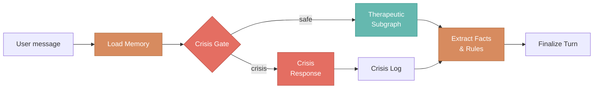
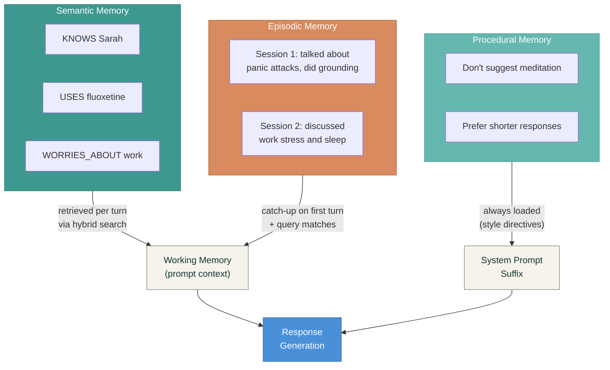

# OpenCouch

OpenCouch is an open-source mental health support agent built on
[LangGraph](https://langchain-ai.github.io/langgraph/) with three
[CoALA](https://arxiv.org/abs/2309.02427)-inspired memory layers
(semantic facts, episodic session arcs, procedural style rules), an
always-on crisis safety gate, and six therapeutic response modes. It
is designed to be private by default, safe by design, and deployable
across hosted and self-hosted modes.

> **What is CoALA?** Cognitive Architectures for Language Agents
> (Princeton, 2023) is a framework proposing that LLM agents should
> organize memory into three distinct types — semantic (facts about
> the world), episodic (narrative records of past experiences), and
> procedural (learned rules about how to behave) — mirroring how
> human cognition works. Most LLM agents only implement semantic
> memory (a vector store of facts); OpenCouch implements all three,
> which is what makes cross-session personalization and style
> adaptation possible. See the
> [Memory Layers](/docs/memory/overview) page for how each layer
> works in practice.

**What it is:**

- A mental health support product that remembers you across sessions
- A LangGraph-based agent with explicit graph execution (not a
  prompt-and-pray wrapper)
- A development prototype with 476+ tests, 5 eval harnesses, and
  CLI-first dogfood tooling

**What it is not:**

- Not a licensed therapist
- Not a diagnostic tool
- Not an emergency service
- Not yet suitable for real-user support (prompts have not been
  clinically reviewed)

## How a turn flows

Every user message passes through the same pipeline. Safety runs
first, memory loads before response generation, and extraction runs
after — so the agent always has context and never skips safety.

## Three memory layers

The agent remembers you across sessions through three distinct
memory types, each with its own write trigger and retrieval
strategy.

## Capabilities

  

    

      <svg className="doc-card__icon" viewBox="0 0 24 24" fill="none" stroke="currentColor" strokeWidth="2"><path d="M12 22s8-4 8-10V5l-8-3-8 3v7c0 6 8 10 8 10z"/></svg>
      <strong>Crisis Safety</strong>
    

    
Always-on hybrid regex + LLM crisis gate with 42-case eval dataset and persistent audit log.

  

  

    

      <svg className="doc-card__icon" viewBox="0 0 24 24" fill="none" stroke="currentColor" strokeWidth="2"><path d="M21 15a2 2 0 01-2 2H7l-4 4V5a2 2 0 012-2h14a2 2 0 012 2z"/></svg>
      <strong>Therapeutic Modes</strong>
    

    
Six response modes: supportive, reflective, clarifying, psychoeducation, guided exercise, closing.

  

  

    

      <svg className="doc-card__icon" viewBox="0 0 24 24" fill="none" stroke="currentColor" strokeWidth="2"><circle cx="12" cy="12" r="10"/><path d="M12 16v-4M12 8h.01"/></svg>
      <strong>Semantic Memory</strong>
    

    
LLM-extracted facts from user turns with hot-path dedup and hybrid retrieval.

  

  

    

      <svg className="doc-card__icon" viewBox="0 0 24 24" fill="none" stroke="currentColor" strokeWidth="2"><path d="M4 19.5A2.5 2.5 0 016.5 17H20"/><path d="M6.5 2H20v20H6.5A2.5 2.5 0 014 19.5v-15A2.5 2.5 0 016.5 2z"/></svg>
      <strong>Episodic Memory</strong>
    

    
Session-end summarization with cross-session catch-up on first turn.

  

  

    

      <svg className="doc-card__icon" viewBox="0 0 24 24" fill="none" stroke="currentColor" strokeWidth="2"><path d="M12 20h9M16.5 3.5a2.121 2.121 0 013 3L7 19l-4 1 1-4L16.5 3.5z"/></svg>
      <strong>Procedural Memory</strong>
    

    
User style rules ("don't suggest meditation"), proactive recall toggle.

  

  

    

      <svg className="doc-card__icon" viewBox="0 0 24 24" fill="none" stroke="currentColor" strokeWidth="2"><path d="M21 16V8a2 2 0 00-1-1.73l-7-4a2 2 0 00-2 0l-7 4A2 2 0 003 8v8a2 2 0 001 1.73l7 4a2 2 0 002 0l7-4A2 2 0 0021 16z"/></svg>
      <strong>Durable Persistence</strong>
    

    
SQLite-backed storage for all three memory layers and the crisis log.

  

  

    

      <svg className="doc-card__icon" viewBox="0 0 24 24" fill="none" stroke="currentColor" strokeWidth="2"><circle cx="11" cy="11" r="8"/><path d="M21 21l-4.35-4.35"/></svg>
      <strong>Hybrid Retrieval</strong>
    

    
Embedding similarity + token-recall fused via Reciprocal Rank Fusion.

  

  

    

      <svg className="doc-card__icon" viewBox="0 0 24 24" fill="none" stroke="currentColor" strokeWidth="2"><rect x="3" y="11" width="18" height="11" rx="2" ry="2"/><path d="M7 11V7a5 5 0 0110 0v4"/></svg>
      <strong>Privacy Controls</strong>
    

    
Per-record deletion, namespace-wide wipe, crisis log retention purge, recall toggle.

  

  

    

      <svg className="doc-card__icon" viewBox="0 0 24 24" fill="none" stroke="currentColor" strokeWidth="2"><path d="M1 12s4-8 11-8 11 8 11 8-4 8-11 8-11-8-11-8z"/><circle cx="12" cy="12" r="3"/></svg>
      <strong>CLI Observability</strong>
    

    
Per-turn stage timings, raw state dump, transcript mode annotations.

  

  

    

      <svg className="doc-card__icon" viewBox="0 0 24 24" fill="none" stroke="currentColor" strokeWidth="2"><path d="M13 2L3 14h9l-1 8 10-12h-9l1-8z"/></svg>
      <strong>Cost Optimization</strong>
    

    
Pre-extractor small-talk gate skips LLM calls on greetings and acknowledgments.

  

