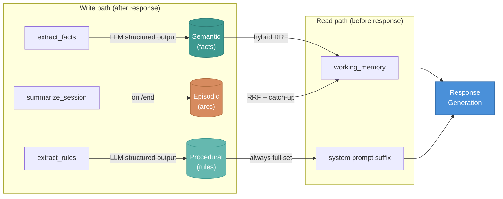
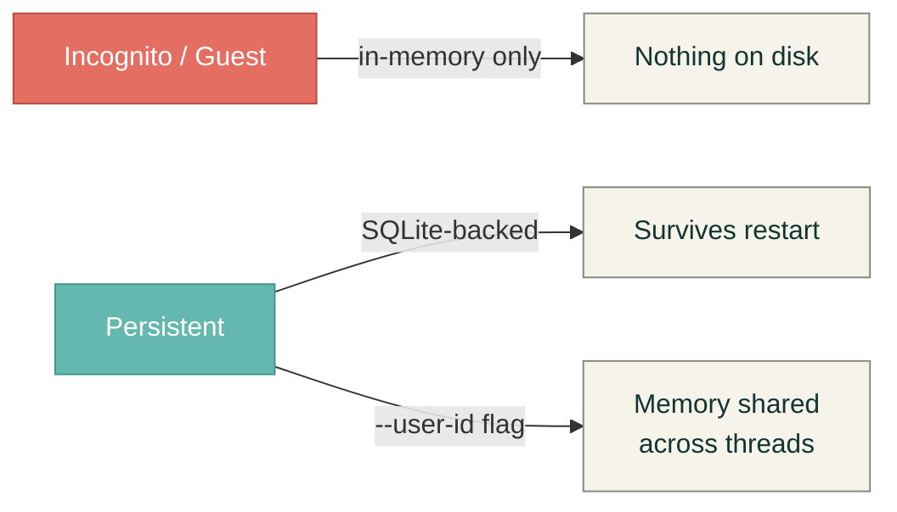

# Memory Layers

Three [CoALA](https://arxiv.org/abs/2309.02427)-inspired memory
layers give the agent persistent context across sessions.

---

## Semantic — facts about the user

Persistent facts extracted from conversation turns, stored as
structured triples.

| | |
|---|---|
| **Examples** | `KNOWS Sarah` — "my sister Sarah visited this weekend" |
| | `USES fluoxetine` — "I take fluoxetine daily" |
| **Write** | `extract_semantic_facts_node` after every response. LLM structured output, conservative (most turns → zero writes). Small-talk gate skips the LLM entirely on greetings. |
| **Dedup** | Token-set Jaccard (0.85 threshold). Duplicates bump `last_referenced_at` instead of writing a new row. |
| **Retrieve** | [Hybrid RRF](/docs/memory/retrieval) — embedding cosine + token-recall fused per turn. Falls back to token-recall when no embedding provider is configured. |
| **Storage** | One row per fact in `memory_records`, namespaced `(owner_id, "semantic")`. Embedding stored as a BLOB alongside the record. |

---

## Episodic — session narratives

One summary per completed session capturing themes, mood arc, open
loops, and a prose narrative.

| | |
|---|---|
| **Example** | *"Talked about panic attacks and did a grounding exercise. Distressed at start, more grounded by end."* |
| **Write** | `run_summarize_session` once per session on `/end` or `/exit`. Single LLM call produces a `StoredSessionArc`. |
| **Retrieve** | Hybrid RRF (same as semantic) **plus first-turn catch-up**: on a new session's first turn, the most recent arc is injected as "Last session (...)" regardless of query match. |
| **Storage** | One row per arc in `memory_records`, namespaced `(owner_id, "episodic")`. |

---

## Procedural — style rules

Explicit user requests about how the agent should respond.

| | |
|---|---|
| **Examples** | "You've said meditation makes you more anxious." |
| | "You prefer shorter responses." |
| **Write** | `extract_procedural_rules_node` after every response. LLM asks "did the user ask me to change how I respond?" Most turns → zero rules. |
| **Retrieve** | **Not query-based.** Full rule set loaded every turn, injected into the system prompt suffix. Rules are directives, not content. |
| **Recall toggle** | `/memory recall on\|off` controls proactive referencing of semantic/episodic content. **Rules always apply** regardless of toggle. |
| **Storage** | Single `ProceduralProfile` document per user, namespaced `(owner_id, "procedural")`. |

---

## Memory modes

| Mode | Writes to disk | Embeddings | Crisis log |
|---|---|---|---|
| **Incognito** | No | No | In-memory only |
| **Persistent** | Yes (SQLite) | Yes | SQLite (survives restart) |

The `--user-id` flag decouples memory identity from thread identity,
so switching threads preserves memory across sessions.
