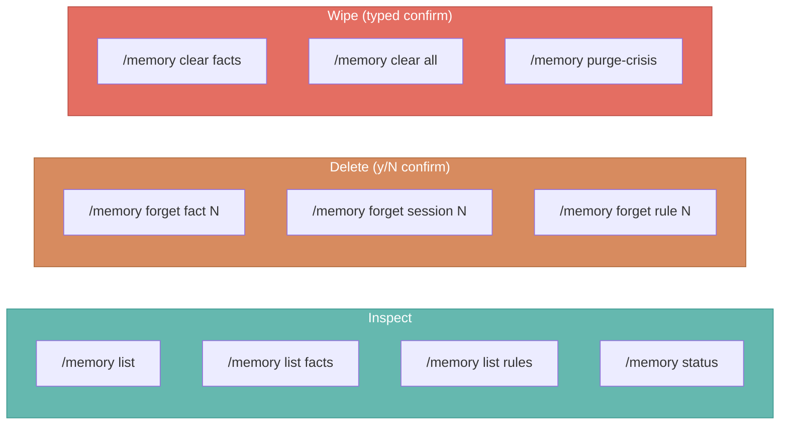

# Privacy Controls

Users can inspect, delete, or wipe anything the agent remembers.



## Inspect

| Command | Shows |
|---|---|
| `/memory status` | Per-namespace counts, mode, recall toggle, owner_id |
| `/memory list` | All semantic facts + episodic arcs |
| `/memory list facts` | Semantic facts only |
| `/memory list sessions` | Episodic arcs only |
| `/memory list rules` | Procedural style rules |

## Delete individual records

| Command | Confirmation |
|---|---|
| `/memory forget fact <n>` | Preview panel + y/N (default N) |
| `/memory forget session <n>` | Preview panel + y/N (default N) |
| `/memory forget rule <n>` | Preview panel + y/N (default N) |

Index numbers match the `#` column in the corresponding list table.
Deletion is immediate and unrecoverable.

## Wipe a namespace

```
/memory clear <facts|sessions|rules|all>
```

Must type the literal word **`clear`** to proceed. `y`, `yes`, and
`CLEAR` all cancel. This asymmetry is intentional — namespace-wide
deletion is a heavy operation and muscle-memory confirmation would be
dangerous.

`/memory clear rules` preserves the `proactive_recall_enabled`
preference (it's a user setting, not content).

## Crisis log retention

```
/memory purge-crisis [days]     # default: 90
```

Must type **`purge`** to proceed. Deletes crisis records older than
the retention window. The boundary is exclusive — the cutoff date
itself is preserved.

The crisis log writes **regardless of memory mode** (privacy
asymmetry for safety audit). In incognito mode it uses an in-memory
backend that dies at CLI exit.

## Recall toggle

```
/memory recall on      # agent may reference past content proactively
/memory recall off     # agent uses stored context only when user brings it up
```

**Procedural rules always apply** regardless of the toggle — the
distinction is between *content recall* (referencing what was said)
and *directive application* (following style rules).

## Owner scoping

All destructive operations are scoped to `session.owner_id()`:

- With `--user-id alice` → affects alice's memory only
- Without `--user-id` → scoped to the thread_id (backward-compatible)

Cross-user deletion is not reachable through the CLI.
