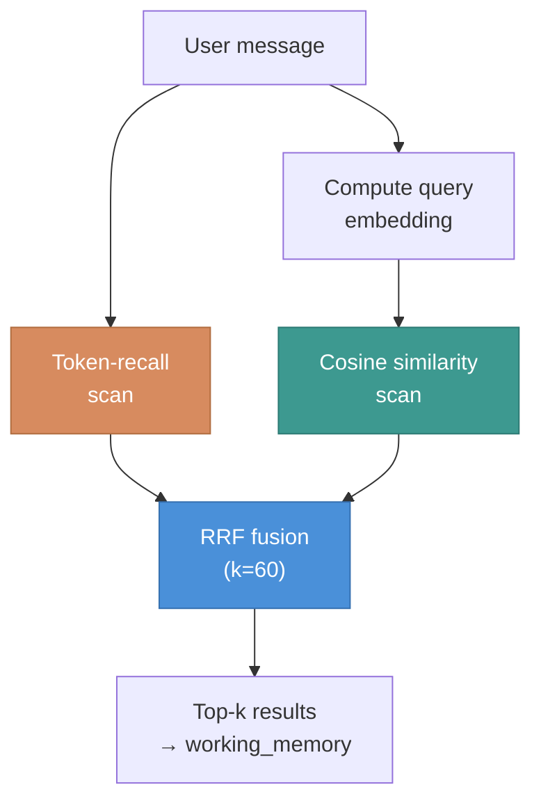

# Hybrid Retrieval

Reciprocal Rank Fusion (RRF) combines two scorers so the agent
handles both exact-name queries and paraphrased queries well.



## Why hybrid?

Neither scorer alone is robust enough for therapy content:

| Scorer | Wins on | Loses on |
|---|---|---|
| **Token-recall** | Proper nouns ("Sarah"), medication names ("fluoxetine"), short queries | Stemming ("anxiety" ↔ "anxious"), synonyms ("sibling" ↔ "sister"), paraphrase |
| **Embedding** | Stemming, synonyms, semantic paraphrase ("I feel stuck" ↔ "things feel hopeless") | Proper nouns (name signal diluted), short queries (too little context) |
| **Hybrid RRF** | Both — fuses by rank position, not raw score | Nothing significant |

RRF's constant `k=60` requires no per-dataset tuning (Cormack et al.
2009).

## How it works

1. **Token-recall**: tokenize the query (stopword-filtered), compute
   `|query ∩ haystack| / |query|` per record, keep matches ≥ 0.33,
   rank by recall
2. **Embedding**: cosine similarity between query embedding and each
   stored embedding, keep matches ≥ 0.5, rank by similarity
3. **RRF**: for each record in either list, `score = Σ 1/(k + rank)`.
   Records in both lists get contributions from both. Sort descending.

## Fallback paths

| Scenario | What happens |
|---|---|
| No embedding provider | Pure token-recall (the pre-embedding behavior) |
| Embedding API failure | Logged, falls back to token-recall for this turn |
| Record has no embedding | Participates in token-recall only |
| Model mismatch | Record skipped in embedding scan |

The `retrieval_path` diagnostic reports which path ran:
`"hybrid_rrf"`, `"token_recall"`, or `"token_recall_after_embed_error"`.

## Embedding storage

Stored as a BLOB alongside each memory record in SQLite:

| Column | Type | Purpose |
|---|---|---|
| `embedding` | BLOB | float32 array via `struct.pack` |
| `embedding_dim` | INTEGER | Dimensionality validation |
| `embedding_model` | TEXT | Model migration detection |

Default provider: Gemini `text-embedding-004` (768 dims). Falls back
to `NullEmbeddingProvider` when no API key is set.

## Eval harness

```bash
# Compare all three scorers (requires API key)
uv run python eval/runners/retrieval_eval.py --mode hybrid --verbose

# Token-recall baseline (no API key needed)
uv run python eval/runners/retrieval_eval.py --mode token-only
```

17 hand-curated cases across 6 categories. Output is a scorer
comparison matrix showing recall@1 / recall@5 per category. Add
cases to `eval/datasets/retrieval_v1.json` when dogfood surfaces a
retrieval failure.
