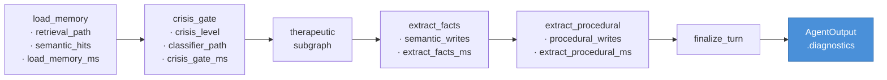
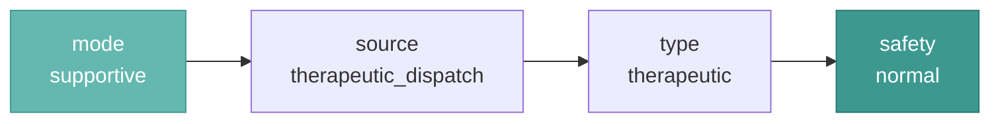
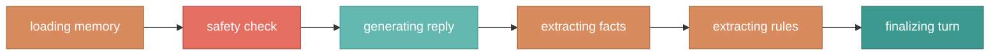

# Observability

The CLI shows you **why** the agent did what it did, not just what
it said. Every turn produces four panels of diagnostics plus
on-demand debugging commands.

---

## How diagnostics flow

Each graph node stamps timing and metadata into a shared
`diagnostics` dict on the state. The dict accumulates through the
pipeline and surfaces in the CLI panels and in `AgentOutput`.



Each node **spreads the existing dict** before adding its own keys —
LangGraph replaces top-level state keys rather than merging them, so
the spread is critical.

---

## CLI panels

Four panels render after every turn:

### 1. Assistant Reply

```text
╭──────────── Support Reply ─────────────╮
│ It sounds like something's on your     │
│ mind. What's most present right now?   │
╰────────────────────────────────────────╯
```

Green border for therapeutic, red for crisis.

### 2. Turn Diagnostics

Routing decisions at a glance.



| Column | What it shows |
|---|---|
| mode | Which mode shaped the reply |
| source | How it was selected |
| safety | normal, distress, check, or crisis |
| reason | The crisis classifier's explanation |

### 3. Stage Timings & Writes

Per-node latency and memory-write activity.

```text
  stage              time (ms)   writes   store Δ
  ━━━━━━━━━━━━━━━━━━━━━━━━━━━━━━━━━━━━━━━━━━━━━━
  load_memory             1.75        -         -
  crisis_gate          1500.62        -         -
  extract_facts        2525.98        1        +1
  extract_procedural   1066.69        0         0
  episodic                   -        -         0
  turn_total           5440.67        -         -
```

**writes** = what the extractor tried to write.
**store Δ** = what actually landed after dedup.
When writes=1 but Δ=0, dedup caught a duplicate.

### 4. Session Context

What the graph carries forward between turns.

```text
  turn_count        3
  working_memory    • Previously noted: my sister Sarah...
                    • Last session (anxiety): talked about...
  procedural_rules  • Don't suggest meditation
  proactive_recall  off
  exercise          box_breathing (step 2)
```

Working memory and rules render as bulleted lists.
Exercise row only appears when a guided exercise is active.

---

## Debug commands

| Command | What it shows |
|---|---|
| `/debug state` | Raw graph state as pretty-printed JSON |
| `/context` | Session Context panel on demand |
| `/history [n]` | Recent transcript with `mode` column per assistant turn |
| `/memory status` | Per-namespace counts, recall toggle, owner_id |
| `/status` | Thread id, mode, turn count, LLM client status |

---

## Live streaming

`run_turn_stream` emits one `StatusEvent` per node as it completes
via LangGraph's multi-mode streaming. The CLI renders these as a
progress spinner:



Stage labels map from internal node names to human-readable labels
via the `_STAGE_LABELS` dict in `opencouch_cli/app.py`.

---

## Adding diagnostics to a new node

```python
import time

start = time.monotonic()

# ... node logic ...

return {
    "diagnostics": {
        **state.get("diagnostics", {}),  # preserve prior nodes
        "my_node_ms": round((time.monotonic() - start) * 1000, 2),
        "my_writes": write_count,
    }
}
```

The spread (`**state.get(...)`) is critical — without it, this
node's delta would overwrite all prior nodes' diagnostics.
