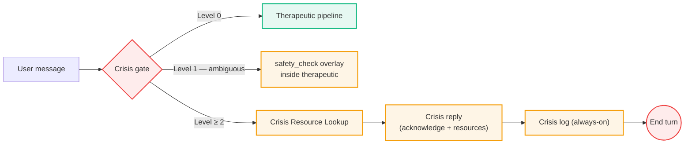

import TherapyApproach from '@site/src/components/TherapyApproach';

# Therapeutic Approach

Not a therapist. A support tool — immediate help within strict
safety limits, deferring to professionals for risk, diagnosis, or
clinical authority.

<TherapyApproach />

---

## What AI handles well here

| Capability | How it works |
|---|---|
| Reflective listening | At any hour, for any duration |
| Structured exercises | 13 exercises across grounding, breathing, thought work, behavioral activation, ACT, self-compassion, and emotion regulation |
| Attuned acknowledgment | Reflects the user's specific situation — no generic empathy |
| Psychoeducation | Brief normalizing explanations of anxiety, stress, grief, and somatic reactions |
| Pattern reflection | Connects themes across a conversation, never inventing patterns the user hasn't named |
| Crisis routing | Region-aware hotline lookup overlaid onto the crisis reply via a dedicated graph node |

## What AI should not attempt

| Boundary | Why |
|---|---|
| Diagnosis | No clinical authority to assess |
| Medication guidance | Requires medical license |
| Trauma processing | Requires trained human relationship |
| Replacing therapy | Bridge, not substitute |

---

## Response styles vs. therapeutic approaches

Two axes, selected independently per turn by the TherapeuticAgent:

| Axis | What it is | How many | Selected by |
|---|---|---|---|
| **Response style** | Turn shape (`supportive`, `reflective`, `clarifying`, `psychoeducation`, `technique`, `guided_exercise`, `closing`) | 7 | LLM structured-output classifier with local active-flow validation |
| **Therapeutic approach** | Framework overlay (MI, CBT, ACT, DBT skills, grief support, IPT, PFA) | 7 | TherapeuticAgent, alongside the response style |

**Response styles** shape *what* the agent does this turn.
**Therapeutic approaches** shape *how* — which knowledge file
loads into the system prompt. In `technique` style, the approach
drives the response shape directly (e.g., CBT Socratic questioning
rhythm or ACT defusion language).

Two style families have hard structural contracts: `guided_exercise`
must produce a step (and pin its approach so it can't drift on
mid-exercise side-turns), `closing` must wrap up. Crisis reply has
its own contract handled outside the TherapeuticAgent by the crisis gate.
The remaining styles form a soft continuum where label fuzziness at
the edges is by design — the dispatcher prompt teaches the LLM how
to distinguish them, and ambiguous cases default to `supportive`.

---

## Safety contract

The crisis gate is the **first runtime stage** — it runs before
memory loading, before any operational gate, before any therapeutic
response.

**When the gate raises level ≥ 2 (clear ideation or imminent risk),
the agent:**

1. **Skips** memory retrieval and the TherapeuticAgent entirely
   — no operational gates, no mode dispatch.
2. **Looks up** verified hotlines for the user's inferred region
   first, so resources land in the same reply.
3. **Acknowledges** the distress directly and calmly, without
   evasion or minimizing.
4. **Asks at most one** safety question (e.g., "Are you safe right
   now?").
5. **Logs** the event to the always-on audit store — even in
   incognito, with `user_id` scrubbed and `session_id` opaqued.

**At level 1 (ambiguous distress with `needs_clarification = true`),
the agent stays inside the therapeutic branch** but uses the
`safety_check` response shape to ask one focused safety probe
before any therapeutic work. Memory retrieval still runs.

See [Crisis Gate](/docs/philosophy/crisis-gate) for the full
detection architecture (LLM classifier + truth-table normalization +
audit log).
