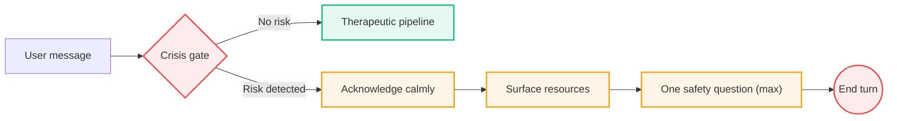

import TherapyApproach from '@site/src/components/TherapyApproach';

# Therapeutic Approach

Not a therapist. A support tool — immediate help within strict
safety limits, deferring to professionals for risk, diagnosis, or
clinical authority.

<TherapyApproach />

---

## What AI handles well here

| Capability | How it works |
|---|---|
| Reflective listening | At any hour, for any duration |
| Structured exercises | 12 exercises: grounding, thought work, activation, ACT, self-compassion, regulation |
| Attuned acknowledgment | Reflects the user's specific situation — no generic empathy |
| Psychoeducation | Brief normalizing explanations of anxiety, stress, grief |
| Pattern reflection | Connects themes across a conversation |
| Crisis routing | Web-searched local hotlines surfaced automatically |

## What AI should not attempt

| Boundary | Why |
|---|---|
| Diagnosis | No clinical authority to assess |
| Medication guidance | Requires medical license |
| Trauma processing | Requires trained human relationship |
| Replacing therapy | Bridge, not substitute |

---

## Modes vs. modalities

Two axes, selected independently per turn:

| Axis | What it is | How many | Selected by |
|---|---|---|---|
| **Mode** | Response style (supportive, reflective, clarifying, psychoeducation, guided_exercise, closing) | 6 | LLM structured-output classifier (regex fallback only when LLM unavailable) |
| **Modality** | Therapeutic framework overlay (MI, PFA, CBT, grief, IPT, ACT, DBT) | 7 | LLM dispatcher, alongside the mode |

**Modes** shape *what* the agent does this turn. **Modalities**
shape *how* — which knowledge file loads into the system prompt.

Three modes have hard structural contracts: `guided_exercise` (must
produce a step), `closing` (must wrap up), `crisis` (must follow
safety protocol). The other three form a soft continuum where label
fuzziness at the edges is by design.

---

## Safety contract

The crisis gate is the **first node in the graph** — it runs before
memory loading, before routing, before any therapeutic response.

**When the gate fires, the agent:**

1. **Stops** normal conversation immediately — no therapeutic response is generated
2. **Acknowledges** the distress directly and calmly, without evasion or minimizing
3. **Surfaces resources** — emergency services and web-searched local crisis hotlines
4. **Asks at most one** follow-up safety question (e.g., "Are you safe right now?")
5. **Does not** attempt therapeutic intervention, advice, or de-escalation techniques

See [Crisis Gate](/docs/philosophy/crisis-gate) for the full
detection architecture (LLM classifier + regex fallback + audit log).
