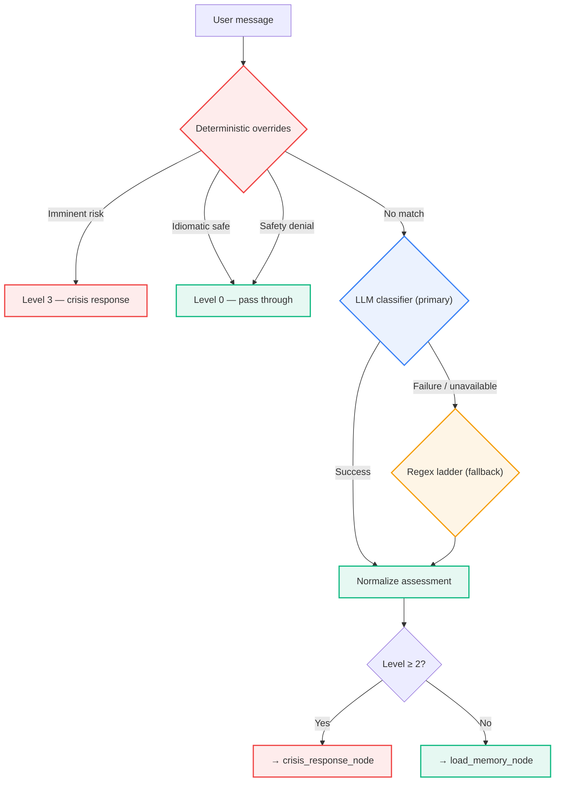

# Crisis Gate

First node in the graph. Every message passes through it before
memory loads, before routing, before response generation. Cannot be
skipped.

---

## Architecture

**LLM-primary** with deterministic overrides and regex fallback:

---

## Decision paths

| Path | When it fires | What it does |
|---|---|---|
| **1. Overrides** | Always runs first (instant, no network) | Imminent-risk patterns → level 3. Idiomatic-safe patterns → level 0. Safety-denial after a check → level 0. |
| **2. LLM classifier** | Primary path for all non-override messages | Structured output with full conversation context. Handles negation, sarcasm, quoted speech, ambiguity. |
| **3. Regex ladder** | Only when LLM unavailable or call fails | Deterministic fallback using pattern categories below. Provides degraded but functional safety coverage. |

The LLM path also runs a **shadow deterministic assessment** in parallel. Disagreements are logged for drift monitoring — if regex flags level 2+ but the LLM returns level 0, a warning is emitted.

---

## Pattern categories

| Category | Level | Example |
|---|---|---|
| **Imminent risk** | 3 | Plan + means + timing ("tonight I'm going to...") |
| **Clear self-harm** | 2 | Unambiguous ideation ("I want to kill myself", "kms") |
| **Ambiguous** | 1 | Possible risk needing clarification ("I can't do this anymore") |
| **Distress** | 1 | Severe distress without explicit self-harm ("hopeless", "breaking point") |
| **Idiomatic safe** | 0 | Benign hyperbole ("work is killing me", "I'm dead 💀") |
| **Safety denial** | 0 | De-escalation after a safety check ("I'm safe", "just venting") |

---

## Level truth table

Normalization enforces this table regardless of what the classifier returned:

| Level | `needs_crisis_response` | `needs_clarification` | Route |
|---|---|---|---|
| 0 | `false` | `false` | Therapeutic |
| 1 | `false` | `true` | Therapeutic (with safety check in response) |
| 2 | `true` | `false` | Crisis response |
| 3 | `true` | `false` | Crisis response |

---

## Route decision

| Route | Condition | Pipeline |
|---|---|---|
| `crisis` | `needs_crisis_response = true` | crisis_response → crisis_log → finalize |
| `therapeutic` | `needs_crisis_response = false` | load_memory → therapeutic_subgraph → finalize |

Expressed as `Command(goto=...)` — the only branching node in the graph.

---

## Privacy asymmetry

Crisis log writes **regardless of memory mode**:

| In incognito | Behavior |
|---|---|
| `user_id_or_null` | `None` — no identity persisted |
| `session_id_opaque` | SHA-256 hash, no reverse mapping |
| Event recorded? | **Yes** — safety audit trail preserved |

Retention: 90 days. `/memory purge-crisis [days]` enforces the
window (exclusive boundary — cutoff date itself preserved).

---

## Diagnostics

| Key | Value |
|---|---|
| `crisis_gate_ms` | Wall-clock time for the full assessment |
| `crisis_classifier_path` | `override` / `llm_primary` / `deterministic` |
| `crisis_level` | Normalized level (0–3) |
| `crisis_shadow_deterministic_level` | What the regex ladder would have returned (shadow monitoring) |

---

## Design rules

| Rule | Why |
|---|---|
| Response pipeline waits for the gate | Safety sequencing > latency |
| Overrides fire before any network call | Imminent risk cannot wait 1–2s for LLM |
| LLM is primary, not regex | Handles negation, context, sarcasm, quoted speech |
| Shadow monitoring logs disagreements | Detects LLM drift without blocking the response |
| Normalization enforces truth table | Prevents miscalibrated LLM from wrong-flagging |
| 42-case eval dataset | Covers imminent risk, clear self-harm, idiomatic-safe, boundary cases |

---

## Key files

| File | Purpose |
|---|---|
| `agent/nodes/crisis_gate.py` | Override detection, LLM classifier, deterministic fallback, normalization |
| `agent/nodes/crisis_response.py` | PFA-overlay response + web-searched local resources |
| `agent/nodes/crisis_log.py` | Always-on audit record writer |
| `agent/memory/crisis_log.py` | Backend protocol + in-memory + null |
| `agent/memory/sqlite_crisis_log.py` | SQLite backend with 90-day retention |
| `eval/runners/crisis_gate_eval.py` | Deterministic eval runner |
