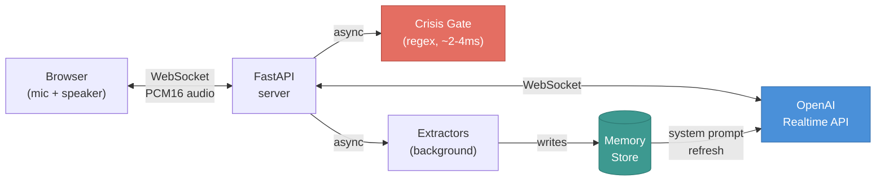

# Voice Chat

OpenCouch supports natural voice conversations via the OpenAI
Realtime API. The Realtime model handles speech-to-text, response
generation, and text-to-speech in a single fused model call —
delivering natural prosody, emotional tone matching, and ~300ms
time-to-first-token.



## How it works

1. **Browser captures mic audio** and streams PCM16 chunks over
   WebSocket to the FastAPI server
2. **Server proxies audio** to the OpenAI Realtime API session
3. **Realtime handles everything** — speech recognition, response
   generation with natural voice, and turn detection (knows when
   the user stops speaking)
4. **Crisis gate runs on every transcript** — when Realtime
   transcribes the user's speech, the deterministic regex tier
   checks for crisis signals (~2-4ms). If detected:
   `response.cancel` + crisis template injection
5. **Extractors run async** after each turn — same semantic fact
   and procedural rule extraction as text mode, running in the
   background without blocking the voice response
6. **System prompt refreshes** when memory changes — new facts or
   rules are immediately visible to the Realtime model

## System prompt

The Realtime model receives a comprehensive system prompt built
from:

| Source | What it provides |
|---|---|
| `knowledge/soul.md` | Identity, voice, tone |
| `knowledge/identity.md` | Product boundaries |
| `knowledge/policy/` | Safety policy |
| Voice-specific instructions | Concise responses, spoken language, energy matching |
| All mode knowledge files | Support, reflection, psychoeducation, closing, guided exercise |
| MI modality | Motivational Interviewing conversational stance |
| Procedural rules | User style preferences ("don't suggest meditation") |
| Semantic facts | Known facts about the user |
| Episodic arcs | Past session summaries |

The model picks the appropriate response register implicitly based
on conversation context — no explicit dispatcher. This trades the
text mode's precise 6-mode dispatch for Realtime's natural
conversational flow.

## Web search tool

A `search_crisis_resources` function is defined in the Realtime
session. The model calls it when:

- The user is in crisis and needs verified contact information
- The user mentions a specific country or region
- The user asks for therapist referrals or local services

The search executes via the existing LLM client's grounded web
search (`use_search=True`). Results are returned to Realtime, which
speaks them naturally. Falls back to static 988 + international
resources if the search fails.

## Session lifecycle

| Event | What happens |
|---|---|
| **Connect** | Memory loaded → system prompt built → Realtime session opened |
| **Each turn** | Transcript → crisis gate → Realtime responds → extractors run async |
| **Memory write** | System prompt refreshed with new facts/rules |
| **Disconnect** | Session summarized → episodic arc written to memory |

The episodic arc from a voice session appears in future sessions'
first-turn catch-up and in the CLI's `/memory list sessions`.

## Running voice mode

```bash
# Start voice server and open browser
uv run python -m opencouch_cli --voice

# Custom port
uv run python -m opencouch_cli --voice --port 9000
```

Or start the server directly:

```bash
uv run uvicorn main:app --port 8000
# Open http://localhost:8000/api/voice/test
```

## Differences from text mode

| Concern | Text mode | Voice mode |
|---|---|---|
| **Response generation** | LangGraph therapeutic subgraph (explicit 6-mode dispatch) | OpenAI Realtime (implicit register from system prompt) |
| **Crisis gate** | Sequential graph node (hard architectural gate) | Regex pre-check on transcript (same patterns, ~2-4ms) |
| **Voice quality** | N/A | Natural prosody, emotional tone matching |
| **Latency** | ~1-2s per turn | ~300ms TTFT |
| **Memory extraction** | Graph nodes post-response | Same extractors, async background |
| **Session summarization** | `/end` command | Automatic on disconnect |
| **Diagnostics** | Stage Timings panel, /debug state | Server logs only |
| **Guided exercise steps** | Explicit state tracking | Relies on Realtime's conversation context |

## Environment variables

Required in `.env.local`:

```
OPENAI_API_KEY=...          # For Realtime API + TTS
GEMINI_API_KEY=...          # For therapeutic LLM + embeddings + extractors
```
